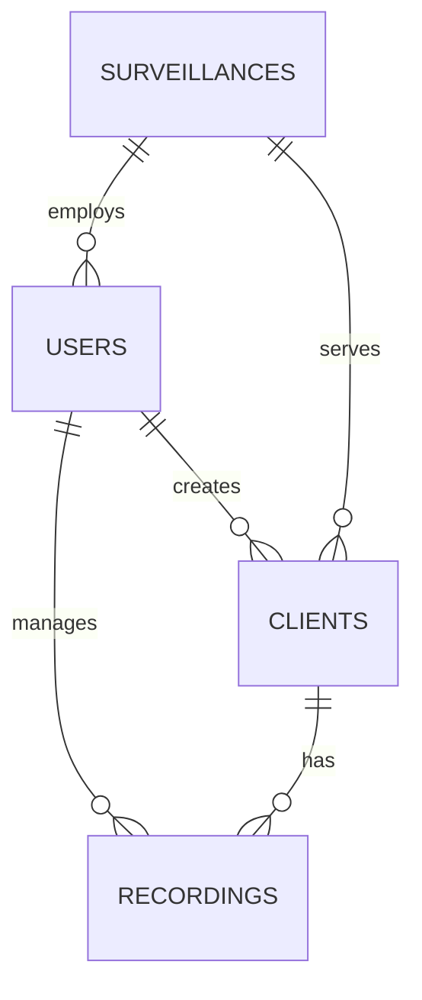
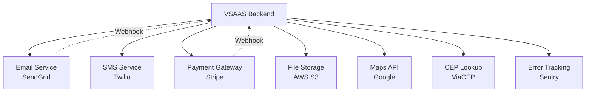
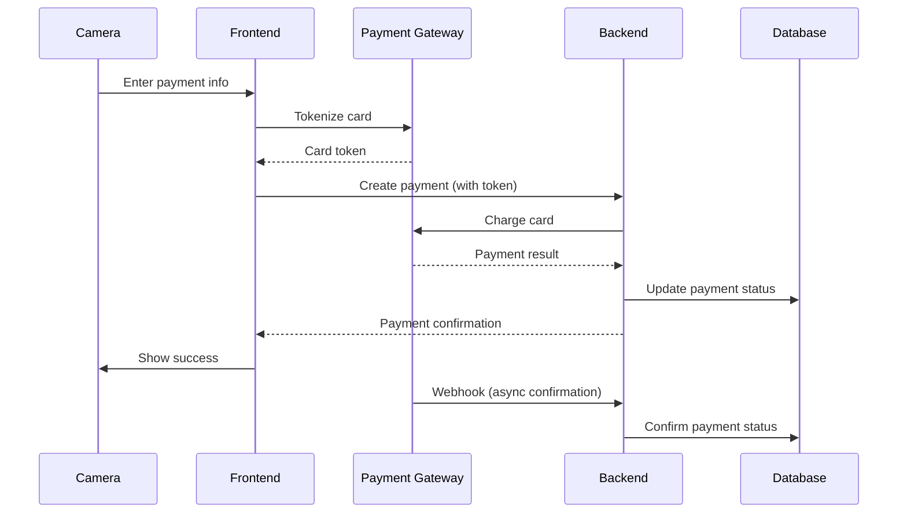

# VSAAS Backend Review - Modular Prompt Suite

## Overview

This document contains **8 specialized prompts** for comprehensive backend analysis of the VSAAS system. Each prompt focuses on a specific aspect and can be used independently or as a complete review sequence.

---

## **PROMPT 1: Initial Setup & Architecture Analysis**

### Objective
Establish a comprehensive analysis of the VSAAS backend codebase, document the technology stack, and analyze the overall architecture.

### Tasks

#### 1. Technology Stack Inventory
Document all technologies:
- **Language & Runtime**: Node.js (version?), Python, Java, etc.
- **Framework**: Express, NestJS, FastAPI, Spring Boot, etc.
- **Database**: PostgreSQL, MySQL, MongoDB (version?)
- **ORM/Query Builder**: Prisma, TypeORM, Sequelize, SQLAlchemy, etc.
- **Authentication**: JWT, OAuth2, Passport, etc.
- **Caching**: Redis, Memcached, in-memory
- **File Storage**: S3, local, Google Cloud Storage
- **Email Service**: SendGrid, AWS SES, SMTP
- **Task Queue**: Bull, RabbitMQ, Celery, SQS
- **Logging**: Winston, Morgan, Pino, etc.
- **Monitoring**: Sentry, DataDog, New Relic, etc.
- **Testing**: Jest, Mocha, PyTest, JUnit
- **Documentation**: Swagger/OpenAPI, Postman

**Deliverable**: Complete technology stack table

#### 2. Project Structure Analysis
```
backend/
├── src/
│   ├── controllers/
│   ├── services/
│   ├── models/
│   ├── repositories/
│   ├── middlewares/
│   ├── routes/
│   ├── utils/
│   ├── config/
│   ├── types/
│   └── validators/
├── tests/
├── migrations/
├── seeds/
├── docs/
└── scripts/
```

Document:
- Total files in each directory
- File naming conventions
- Organization pattern (feature-based, layer-based, DDD)
- Average file size
- Largest files (>500 lines)

**Deliverable**: Project structure documentation with statistics

#### 3. Dependency Analysis
Create table:
| Package | Version | Purpose | Security Issues | Outdated | Replacement Options |
|---------|---------|---------|-----------------|----------|---------------------|

Identify:
- 🟥 **Critical**: Security vulnerabilities (npm audit, Snyk)
- 🟧 **High**: Outdated packages (>2 major versions)
- 🟨 **Medium**: Unused dependencies
- 🟩 **Low**: Optimization opportunities

**Deliverable**: Dependency audit report

#### 4. Application Bootstrap
Analyze entry point (`server.ts`, `app.ts`, `main.py`, etc.):
- Server initialization
- Middleware stack
- Route registration
- Database connection
- External service initialization
- Error handling setup
- Graceful shutdown handling

**Deliverable**: Application bootstrap documentation

#### 5. Configuration Management
Document:
- Environment variables (list all from `.env.example`)
- Configuration files structure
- Secrets management approach
- Environment-specific configs (dev, staging, prod)
- Configuration validation

**Deliverable**: Configuration management analysis

#### 6. Architecture Pattern
Identify:
- **Architecture style**: MVC, Layered, Hexagonal, Clean Architecture, etc.
- **Design patterns**: Repository, Service Layer, Factory, etc.
- **Code organization**: By feature or by layer
- **Dependency injection**: How implemented

**Deliverable**: Architecture pattern documentation with diagrams

### Output Document
**File**: `01-VSAAS-Backend-Architecture-Overview.md`

**Sections**:
1. Executive Summary
2. Technology Stack
3. Project Structure & Organization
4. Dependency Analysis
5. Application Bootstrap
6. Configuration Management
7. Architecture Pattern
8. Initial Recommendations

---

## **PROMPT 2: Database Architecture & Data Models**

### Objective
Establish a comprehensive analysis of the database schema, data models, relationships, migrations, and database performance.

### Tasks

#### 1. Database Schema Documentation
Create comprehensive schema documentation:

**Tables Inventory**:
| Table Name | Columns | Indexes | Foreign Keys | Row Count (approx) | Purpose |
|------------|---------|---------|--------------|-------------------|---------|
| users | 15 | 4 | 0 | ~1000 | User accounts |
| cameras | 20 | 6 | 1 (surveillance_id) | ~5000 | Camera records |
| recordings | 12 | 5 | 2 | ~10000 | Recordings |
| [Continue...] |

**Deliverable**: Complete table inventory

#### 2. Entity Relationship Diagram
Create ERD showing:
- All tables
- Relationships (one-to-one, one-to-many, many-to-many)
- Primary keys
- Foreign keys
- Indexes



**Deliverable**: Complete ERD in Mermaid or standard ER notation

#### 3. Data Model Deep Dive
For each major entity:

**Entity**: Camera

**Table**: `cameras`

**Columns**:
| Column | Type | Nullable | Default | Index | Constraints | Purpose |
|--------|------|----------|---------|-------|-------------|---------|
| id | UUID | No | gen_random_uuid() | PK | UNIQUE | Primary key |
| name | VARCHAR(255) | No | - | Yes | - | Camera name |
| cpf | VARCHAR(11) | No | - | UNIQUE | - | Brazilian ID |
| birth_date | DATE | No | - | - | - | Date of birth |
| email | VARCHAR(255) | Yes | NULL | Yes | - | Email address |
| phone | VARCHAR(20) | No | - | - | - | Phone number |
| surveillance_id | UUID | No | - | FK | REFERENCES organizations(id) | Organization relationship |
| created_at | TIMESTAMP | No | NOW() | Yes | - | Creation timestamp |
| updated_at | TIMESTAMP | No | NOW() | - | - | Update timestamp |
| deleted_at | TIMESTAMP | Yes | NULL | Yes | - | Soft delete |

**Relationships**:
- Belongs to: Organization (surveillance_id)
- Has many: Recordings
- Has many: MedicalRecords
- Has many: Treatments

**Business Rules**:
- ID must be unique per organization
- Email can be null (not all cameras have email)
- Soft delete enabled (deleted_at)
- Phone is required for communication

**Issues Identified**:
- 🟧 No index on commonly filtered fields (e.g., name)
- 🟨 Large VARCHAR(255) for name (could be optimized)
- 🟩 Consider full-text search for name field

**Deliverable**: Complete documentation for 10-15 major entities

#### 4. Migration Analysis
Review all migration files:
- Total migrations: ?
- Migration naming convention
- Reversibility (up/down migrations)
- Data migrations vs schema migrations
- Migration order and dependencies

**Migration Quality Check**:
- 🟥 **Critical**: Migrations without rollback
- 🟧 **High**: Data loss risk in migrations
- 🟨 **Medium**: Performance issues (e.g., adding index to large table without CONCURRENT)
- 🟩 **Low**: Missing migration documentation

**Deliverable**: Migration analysis report

#### 5. Database Performance Analysis

**Index Analysis**:
| Table | Index Name | Columns | Type | Size | Usage | Issues |
|-------|-----------|---------|------|------|-------|--------|
| cameras | idx_clients_cpf | cpf | BTREE | 2MB | High | None |
| recordings | idx_appt_date | date | BTREE | 5MB | High | None |
| [Continue...] |

**Missing Indexes**:
- 🟧 `cameras.name` (frequently searched)
- 🟧 `recordings.status` (frequently filtered)
- 🟨 `medical_records.client_id, created_at` (composite for common queries)

**Query Performance**:
- Slow queries identified: [List if available]
- N+1 query problems: [Check common endpoints]
- Missing JOIN optimizations

**Deliverable**: Database performance report

#### 6. Data Integrity Analysis

**Constraints**:
- Primary keys: All tables? ✓ / Issues
- Foreign keys: Properly defined? ✓ / Issues
- Unique constraints: Where needed? ✓ / Issues
- Check constraints: Business rules enforced? ✓ / Issues
- NOT NULL constraints: Properly used? ✓ / Issues

**Data Validation**:
- Database-level validation vs application-level
- Orphaned records check
- Data consistency issues

**Referential Integrity**:
- ON DELETE CASCADE vs RESTRICT vs SET NULL
- Soft delete implementation
- Audit trail

**Deliverable**: Data integrity assessment

#### 7. Database Normalization
Evaluate:
- Normal form achieved: 1NF, 2NF, 3NF, BCNF
- Denormalization instances (and justification)
- Redundant data
- Data anomalies (insertion, update, deletion)

Identify:
- 🟧 Normalization violations
- 🟨 Appropriate denormalization
- 🟩 Optimization opportunities

**Deliverable**: Normalization analysis

### Output Document
**File**: `02-VSAAS-Database-Architecture.md`

**Sections**:
1. Database Overview
2. Schema Documentation
3. Entity Relationship Diagram
4. Data Model Deep Dive
5. Migration Analysis
6. Database Performance
7. Data Integrity
8. Normalization Assessment
9. Improvement Recommendations

---

## **PROMPT 3: API Design & Endpoints**

### Objective
Establish a comprehensive analysis of the API Design & Endpoints. Document all API endpoints, analyze RESTful design, evaluate request/response patterns, and assess API quality.

### Tasks

#### 1. Complete API Endpoint Inventory
Create comprehensive endpoint catalog:

| Method | Endpoint | Controller | Handler | Auth | Roles | Request Body | Response | Status Codes |
|--------|----------|------------|---------|------|-------|--------------|----------|--------------|
| POST | /api/auth/login | AuthController | login | No | Public | {email, password} | {token, user} | 200, 400, 401 |
| GET | /api/cameras | ClientController | list | Yes | Admin, Staff | Query params | Camera[] | 200, 401, 403 |
| POST | /api/cameras | ClientController | create | Yes | Admin, Staff | Camera data | Camera | 201, 400, 401, 403 |
| GET | /api/cameras/:id | ClientController | show | Yes | Admin, Staff, Operator | - | Camera | 200, 401, 403, 404 |
| PUT | /api/cameras/:id | ClientController | update | Yes | Admin, Staff | Partial Camera | Camera | 200, 400, 401, 403, 404 |
| DELETE | /api/cameras/:id | ClientController | destroy | Yes | Admin | - | - | 204, 401, 403, 404 |
| [Continue for all endpoints...] |

**Deliverable**: Complete API endpoint catalog (50-200 endpoints typical)

#### 2. RESTful Design Evaluation

**REST Principles Compliance**:
- ✅ Resource-based URLs (not action-based)
- ✅ Proper HTTP methods (GET, POST, PUT, DELETE, PATCH)
- ✅ Stateless communication
- ✅ Standard status codes
- ✅ HATEOAS (if applicable)

**Common REST Violations**:
- 🟧 `POST /api/cameras/search` (should be GET with query params)
- 🟧 `GET /api/recordings/create` (should be POST /api/recordings)
- 🟨 Inconsistent URL patterns
- 🟨 Non-standard status codes

**URL Design Quality**:
```
✅ Good: /api/v1/cameras/:id/recordings
❌ Bad: /api/getClientRecordings?clientId=123

✅ Good: /api/v1/organizations/:surveillanceId/staff
❌ Bad: /api/staff?organization=123

✅ Good: /api/v1/recordings?date=2025-10-15&status=confirmed
❌ Bad: /api/recordings/filter/2025-10-15/confirmed
```

**Deliverable**: REST compliance report

#### 3. Request/Response Pattern Analysis

**Standard Request Pattern**:
```typescript
// POST /api/cameras
{
  "name": "João Silva",
  "cpf": "12345678900",
  "birth_date": "1990-05-15",
  "email": "joao@example.com",
  "phone": "11987654321",
  "address": {
    "cep": "01310-100",
    "street": "Avenida Paulista",
    "number": "1000",
    "complement": "Apto 101",
    "neighborhood": "Bela Vista",
    "city": "São Paulo",
    "state": "SP"
  },
  "medical_info": {
    "allergies": ["Penicilina"],
    "conditions": ["Hipertensão"],
    "medications": ["Losartana 50mg"]
  }
}
```

**Standard Success Response**:
```typescript
// 201 Created
{
  "success": true,
  "data": {
    "id": "uuid-here",
    "name": "João Silva",
    "cpf": "12345678900",
    // ... all fields
    "created_at": "2025-10-15T14:30:00Z",
    "updated_at": "2025-10-15T14:30:00Z"
  },
  "message": "Paciente criado com sucesso"
}
```

**Standard Error Response**:
```typescript
// 400 Bad Request
{
  "success": false,
  "error": {
    "code": "VALIDATION_ERROR",
    "message": "Dados inválidos",
    "details": [
      {
        "field": "cpf",
        "message": "ID inválido"
      },
      {
        "field": "email",
        "message": "Email já cadastrado"
      }
    ]
  }
}
```

**Response Consistency Check**:
- Consistent envelope format: ✓ / ✗
- Consistent field naming (camelCase vs snake_case): ?
- Consistent date formatting (ISO 8601): ✓ / ✗
- Consistent error format: ✓ / ✗
- Consistent pagination format: ✓ / ✗

**Deliverable**: Request/response pattern documentation

#### 4. Pagination, Filtering & Sorting

**Pagination Pattern**:
```typescript
// Request
GET /api/cameras?page=1&limit=20

// Response
{
  "data": [...],
  "pagination": {
    "current_page": 1,
    "per_page": 20,
    "total": 150,
    "total_pages": 8,
    "has_next": true,
    "has_previous": false
  }
}
```

**Filtering Pattern**:
```typescript
// Examples
GET /api/cameras?name=João&status=active
GET /api/recordings?date_from=2025-10-01&date_to=2025-10-31&status=confirmed
GET /api/cameras?search=joão silva
```

**Sorting Pattern**:
```typescript
// Examples
GET /api/cameras?sort=name&order=asc
GET /api/recordings?sort=date&order=desc
GET /api/cameras?sort=name,created_at&order=asc,desc
```

**Evaluate**:
- 🟥 No pagination (returns all records)
- 🟧 Inconsistent pagination across endpoints
- 🟨 Limited filtering options
- 🟨 No search functionality
- 🟩 Advanced filtering needed

**Deliverable**: Pagination/filtering/sorting analysis

#### 5. API Versioning Strategy
Document:
- Versioning approach: URL (`/api/v1/`), Header, Query param, None
- Current version: v?
- Deprecated versions: [List]
- Version migration strategy
- Breaking change handling

**Deliverable**: API versioning documentation

#### 6. Rate Limiting & Throttling
Analyze:
- Rate limiting implemented: Yes / No
- Rate limit strategy: Per user, Per IP, Global
- Rate limit values: ? requests per ? time
- Rate limit headers: X-RateLimit-Limit, X-RateLimit-Remaining
- Throttling for expensive operations
- DDoS protection

**Deliverable**: Rate limiting assessment

#### 7. API Documentation Quality
Evaluate:
- Swagger/OpenAPI spec: Exists / Outdated / Missing
- Documentation completeness: ?%
- Request examples: Present / Missing
- Response examples: Present / Missing
- Error codes documented: Yes / No
- Authentication documented: Yes / No

**Deliverable**: API documentation assessment

### Output Document
**File**: `03-VSAAS-API-Design.md`

**Sections**:
1. API Overview
2. Complete Endpoint Inventory
3. RESTful Design Evaluation
4. Request/Response Patterns
5. Pagination, Filtering & Sorting
6. API Versioning
7. Rate Limiting
8. API Documen## **PROMPT 3: API Design & Endpoints**
tation Quality
9. Improvement Recommendations

---

## **PROMPT 4: Authentication, Authorization & Security**

### Objective
Establish a comprehensive analysis of the authentication mechanisms, authorization logic, role-based access control, and security practices.

### Tasks

#### 1. Authentication Mechanism Analysis

**Authentication Strategy**:
- Type: JWT, Session-based, OAuth2, SSO, Hybrid
- Token type: Bearer, Refresh token, Access token
- Token storage: Database, Redis, In-memory
- Token expiration: Access (? minutes), Refresh (? days)
- Token refresh mechanism: Implemented / Not implemented

**Login Flow Documentation**:
```typescript
// POST /api/auth/login
Request: {
  email: string,
  password: string,
  remember_me?: boolean
}

Process:
1. Validate input
2. Find user by email
3. Verify password (bcrypt compare)
4. Check user status (active, suspended, etc.)
5. Generate JWT token
6. Log login event
7. Return token + user data

Response: {
  token: string,
  refresh_token?: string,
  user: User,
  expires_in: number
}
```

**Password Management**:
- Hashing algorithm: bcrypt, argon2, PBKDF2
- Salt rounds / work factor: ?
- Password requirements: Min length, complexity rules
- Password reset flow: Implemented / Not implemented
- Password reset token: Expiration time, storage

**Deliverable**: Authentication mechanism documentation

#### 2. Authorization & RBAC Analysis

**Role Hierarchy**:
```
SuperAdmin (root access)
  └─ Admin (organization-level management)
      └─ Operator (operator - camera care)
          └─ Staff (administrative tasks)
              └─ Camera (self-service)
```

**Permission Model**:
- Permission structure: Role-based only, or Role + Permission granular
- Permission naming: CRUD pattern, or custom
- Permission storage: Database, Hardcoded, Config file

**Role-Permission Matrix**:
| Permission | SuperAdmin | Admin | Operator | Staff | Camera |
|------------|-----------|-------|----------|-------|---------|
| users.create | ✓ | ✓ | ✗ | ✗ | ✗ |
| users.read | ✓ | ✓ | ✗ | ✗ | ✗ |
| users.update | ✓ | ✓ | ✗ | ✗ | ✗ |
| users.delete | ✓ | ✗ | ✗ | ✗ | ✗ |
| cameras.create | ✓ | ✓ | ✗ | ✓ | ✗ |
| cameras.read | ✓ | ✓ | ✓ | ✓ | Own only |
| cameras.update | ✓ | ✓ | ✗ | ✓ | Own only |
| cameras.delete | ✓ | ✓ | ✗ | ✗ | ✗ |
| recordings.create | ✓ | ✓ | ✓ | ✓ | ✓ |
| recordings.read | ✓ | ✓ | ✓ | ✓ | Own only |
| recordings.update | ✓ | ✓ | ✓ | ✓ | Own only |
| recordings.delete | ✓ | ✓ | ✗ | ✗ | ✗ |
| [Continue for all permissions...] |

**Deliverable**: Complete role-permission matrix

#### 3. Authorization Middleware Analysis

**Middleware Chain**:
```typescript
// Example flow
app.use(authenticateJWT);  // Verify token
app.use(authorizeRole(['admin', 'staff']));  // Check role
app.use(authorizePermission('cameras.create'));  // Check permission
```

**Authorization Patterns**:
```typescript
// Pattern 1: Role-based
@Roles(['admin', 'staff'])
async createClient() { }

// Pattern 2: Permission-based
@RequirePermission('cameras.create')
async createClient() { }

// Pattern 3: Custom guard
@UseGuards(OwnershipGuard)
async updateClient(@Param('id') id: string) { }
```

**Ownership Validation**:
- Camera can only access own records
- Operator can only access assigned cameras
- Staff can access organization cameras only
- Admin can access all organization data

**Evaluate**:
- 🟥 **Critical**: Missing authorization checks on sensitive endpoints
- 🟥 **Critical**: Authorization only on frontend (no backend validation)
- 🟧 **High**: Inconsistent authorization patterns
- 🟧 **High**: Overly permissive roles
- 🟨 **Medium**: Complex authorization logic (hard to maintain)
- 🟩 **Low**: Authorization not logged

**Deliverable**: Authorization implementation analysis

#### 4. Security Best Practices Audit

**Input Validation**:
- Validation library: Joi, Yup, Zod, class-validator, express-validator
- Validation coverage: All endpoints / Partial / Missing
- SQL injection prevention: Parameterized queries / ORM
- NoSQL injection prevention: Input sanitization
- XSS prevention: Output encoding, CSP headers
- Command injection prevention: Input validation

**HTTPS & SSL/TLS**:
- HTTPS enforced: Yes / No
- SSL certificate: Valid / Self-signed / Missing
- HSTS header: Enabled / Disabled
- Secure cookie flag: Set / Not set

**CORS Configuration**:
```typescript
{
  origin: ['https://sintgesp.com.br', 'https://app.sintgesp.com.br'],
  credentials: true,
  methods: ['GET', 'POST', 'PUT', 'DELETE', 'PATCH'],
  allowedHeaders: ['Content-Type', 'Authorization']
}
```

Evaluate:
- 🟥 Wildcard CORS (`origin: '*'`) in production
- 🟧 Missing CORS configuration
- 🟨 Overly permissive CORS

**Security Headers**:
- X-Content-Type-Options: nosniff
- X-Frame-Options: DENY
- X-XSS-Protection: 1; mode=block
- Content-Security-Policy: [Policy]
- Strict-Transport-Security: [Policy]

**Deliverable**: Security audit report

#### 5. Sensitive Data Protection

**PII (Personally Identifiable Information)**:
- Camera data: Name, ID, email, phone, address
- Medical records: Diagnoses, treatments, evaluations
- Payment information: Credit cards (if stored)

**Encryption**:
- Data at rest: Encrypted / Not encrypted
- Data in transit: TLS / HTTPS
- Database encryption: Enabled / Disabled
- File encryption: Implemented / Not implemented
- Encryption algorithm: AES-256, RSA, etc.

**Data Masking**:
- ID masking in logs: Implemented / Not implemented
- Credit card masking: N/A / Implemented / Not implemented
- Sensitive data in error messages: Present (bad) / Absent (good)

**LGPD Compliance** (LGPD):
- Data minimization: Collect only necessary data
- Consent management: Implemented / Not implemented
- Right to be forgotten: Implemented / Not implemented
- Data portability: Implemented / Not implemented
- Data breach notification: Process defined / Not defined

**Deliverable**: Data protection assessment

#### 6. Session Management

**Session Configuration**:
- Session storage: Database, Redis, Memory
- Session expiration: ? minutes of inactivity
- Session renewal: On activity / Manual
- Concurrent sessions: Allowed / Prevented / Limited to ?
- Session fixation prevention: Yes / No
- CSRF protection: Implemented / Not needed (JWT) / Missing

**Deliverable**: Session management analysis

#### 7. Audit Logging

**Security Event Logging**:
- Login attempts (success and failure): Logged / Not logged
- Password changes: Logged / Not logged
- Permission changes: Logged / Not logged
- Sensitive data access: Logged / Not logged
- Failed authorization attempts: Logged / Not logged
- API key usage: N/A / Logged / Not logged

**Log Content**:
- User ID
- Action performed
- Timestamp
- IP address
- User agent
- Request details (sanitized)

**Log Security**:
- Sensitive data in logs: Present (bad) / Absent (good)
- Log tampering prevention: Implemented / Not implemented
- Log retention: ? days/months
- Log access control: Who can access logs

**Deliverable**: Audit logging assessment

### Output Document
**File**: `04-VSAAS-Auth-Security.md`

**Sections**:
1. Authentication Mechanism
2. Authorization & RBAC
3. Role-Permission Matrix
4. Authorization Middleware
5. Security Best Practices
6. Sensitive Data Protection
7. LGPD Compliance
8. Session Management
9. Audit Logging
10. Security Recommendations

---

## **PROMPT 5: Business Logic & Service Layer**

### Objective
Establish a comprehensive analysis of the  business logic implementation, service layer architecture, domain models, and business rule enforcement.

### Tasks

#### 1. Service Layer Architecture

**Service Organization**:
```
services/
├── auth.service.ts
├── user.service.ts
├── camera.service.ts
├── recording.service.ts
├── organization.service.ts
├── notification.service.ts
├── report.service.ts
└── [others]
```

**Service Pattern Analysis**:
```typescript
// Example Service
class ClientService {
  constructor(
    private clientRepository: ClientRepository,
    private surveillanceService: SurveillanceService,
    private notificationService: NotificationService
  ) {}

  async createClient(data: CreateClientDTO): Promise<Camera> {
    // Business logic here
  }

  async updateClient(id: string, data: UpdateClientDTO): Promise<Camera> {
    // Business logic here
  }

  // ... other methods
}
```

**Evaluate**:
- Separation of concerns: Good / Mixed responsibilities
- Dependency injection: Used / Not used
- Service coupling: Loose / Tight
- Service size: Appropriate / Too large
- Business logic location: Service layer / Controllers / Models

**Deliverable**: Service layer architecture documentation

#### 2. Business Logic Inventory

For each major domain:

**Domain**: Camera Management

**Core Business Logic**:
1. **Camera Registration**
   - Validate ID uniqueness per organization
   - Validate age (must be >= 0 years old)
   - Send welcome email/SMS
   - Create initial video metadata
   - Assign camera number

2. **Camera Update**
   - Validate data changes
   - Track audit history
   - Notify relevant staff if important data changes
   - Update related records

3. **Camera Deletion**
   - Soft delete (set deleted_at)
   - Check for active recordings
   - Check for pending treatments
   - Archive video metadatas
   - Notify admin

**Business Rules**:
- Rule: A camera cannot be deleted if they have future recordings
- Rule: ID must be unique within a organization (but can repeat across organizations)
- Rule: Camera must be at least 18 years old to consent, otherwise require guardian
- Rule: Email is optional, but if provided must be unique
- Rule: Phone is mandatory for communication

**Deliverable**: Business logic documentation for all major domains

#### 3. Domain Model Analysis

**Domain Models**:

**Model**: Recording

**Properties**:
```typescript
class Recording {
  id: string;
  client_id: string;
  provider_id: string;
  surveillance_id: string;
  date: Date;
  start_time: Time;
  end_time: Time;
  duration: number;  // minutes
  status: RecordingStatus;  // scheduled, confirmed, in_progress, completed, cancelled
  type: RecordingType;  // consultation, treatment, follow_up, emergency
  notes: string;
  cancellation_reason?: string;
  cancelled_by?: string;
  created_at: Date;
  updated_at: Date;
}
```

**Business Methods**:
```typescript
class Recording {
  canBeCancelled(): boolean {
    // Business rule: Can only cancel if > 24h before recording
    const hoursBefore = this.date.diff(now(), 'hours');
    return hoursBefore > 24 && this.status !== 'completed';
  }

  confirm(): void {
    // Business rule: Can only confirm scheduled recordings
    if (this.status !== 'scheduled') {
      throw new Error('Only scheduled recordings can be confirmed');
    }
    this.status = 'confirmed';
  }

  complete(): void {
    // Business rule: Can only complete confirmed or in-progress recordings
    if (!['confirmed', 'in_progress'].includes(this.status)) {
      throw new Error('Invalid status transition');
    }
    this.status = 'completed';
  }
}
```

**Evaluate**:
- Domain models: Anemic (just data) / Rich (data + behavior)
- Business rules: In models / In services / Mixed
- Validation: In models / Separate validators
- Value objects: Used appropriately / Could be used more

**Deliverable**: Domain model documentation

#### 4. Validation Strategy

**Validation Layers**:
1. **Request DTOs** (Input validation)
   ```typescript
   class CreateClientDTO {
     @IsNotEmpty()
     @MinLength(3)
     name: string;

     @IsNotEmpty()
     @IsID()  // Custom validator
     cpf: string;

     @IsEmail()
     @IsOptional()
     email?: string;

     @IsPhoneNumber('BR')
     phone: string;

     @IsDate()
     birth_date: Date;
   }
   ```

2. **Business Rule Validation** (Domain validation)
   ```typescript
   // In service layer
   async createClient(data: CreateClientDTO) {
     // Check ID uniqueness in organization
     const exists = await this.clientRepository.findByID(data.cpf, surveillanceId);
     if (exists) {
       throw new ConflictError('ID já cadastrado nesta clínica');
     }

     // Validate age
     const age = calculateAge(data.birth_date);
     if (age < 0) {
       throw new ValidationError('Data de nascimento inválida');
     }

     // Continue...
   }
   ```

3. **Database Constraints** (Last line of defense)
   ```sql
   ALTER TABLE cameras
     ADD CONSTRAINT clients_cpf_surveillance_unique 
     UNIQUE (cpf, surveillance_id);
   ```

**Validation Coverage**:
- Request validation: Comprehensive / Partial / Missing
- Business rule validation: Comprehensive / Partial / Missing
- Database constraints: Comprehensive / Partial / Missing

**Error Messages**:
- Language: Portuguese / English / Mixed
- User-friendly: Yes / Too technical
- Consistent format: Yes / Inconsistent
- Actionable: Yes / Vague

**Deliverable**: Validation strategy documentation

#### 5. Transaction Management

**Transaction Usage**:
```typescript
// Example: Camera creation with related records
async createClient(data: CreateClientDTO) {
  return await this.db.transaction(async (trx) => {
    // 1. Create camera
    const camera = await this.clientRepository.create(data, trx);
    
    // 2. Create initial video metadata
    await this.medicalRecordRepository.create({
      client_id: camera.id,
      surveillance_id: camera.surveillance_id
    }, trx);
    
    // 3. Send notification
    await this.notificationService.sendWelcome(camera.email);
    
    // 4. Log event
    await this.auditService.log('client_created', camera.id, trx);
    
    return camera;
  });
}
```

**Transaction Analysis**:
- Transaction usage: Appropriate / Overused / Underused
- Nested transactions: Handled correctly / Issues
- Long-running transactions: Present (bad) / Absent (good)
- Transaction isolation level: Read Committed / Serializable / Other
- Deadlock prevention: Implemented / Not addressed

**Identify**:
- 🟥 **Critical**: Missing transactions for multi-step operations
- 🟧 **High**: Improper transaction scope
- 🟨 **Medium**: Transaction timeout not configured
- 🟩 **Low**: Could optimize transaction boundaries

**Deliverable**: Transaction management analysis

#### 6. Error Handling & Business Exceptions

**Custom Exception Hierarchy**:
```typescript
class AppError extends Error {
  statusCode: number;
  code: string;
}

class ValidationError extends AppError {
  constructor(message: string, details?: any) {
    super(message);
    this.statusCode = 400;
    this.code = 'VALIDATION_ERROR';
    this.details = details;
  }
}

class NotFoundError extends AppError { /* 404 */ }
class ConflictError extends AppError { /* 409 */ }
class UnauthorizedError extends AppError { /* 401 */ }
class ForbiddenError extends AppError { /* 403 */ }
class BusinessRuleError extends AppError { /* 422 */ }
```

**Exception Usage**:
```typescript
// Good: Specific exceptions
if (age < 18 && !hasGuardian) {
  throw new BusinessRuleError(
    'Paciente menor de 18 anos precisa de um responsável'
  );
}

// Bad: Generic exceptions
if (age < 18 && !hasGuardian) {
  throw new Error('Invalid age');
}
```

**Evaluate**:
- Custom exceptions: Used / Generic Error used
- Exception hierarchy: Well-designed / Flat
- Error messages: Portuguese / English / Mixed
- Error context: Sufficient / Lacking
- Error logging: Implemented / Missing

**Deliverable**: Error handling assessment

#### 7. Business Rule Enforcement

**Critical Business Rules Documentation**:

**Rule BR-001**: Recording Overlap Prevention
- **Description**: A operator cannot have overlapping recordings
- **Enforcement**: Service layer validation before booking
- **Implementation**: Query database for time conflicts
- **Edge cases**: Handled (buffer time, breaks, etc.)

**Rule BR-002**: Recording Cancellation Policy
- **Description**: Recordings can only be cancelled >24h in advance
- **Enforcement**: Business logic in Recording domain model
- **Exceptions**: Admin can override, emergencies
- **Implementation**: Date comparison with current time

**Rule BR-003**: Camera Access Control
- **Description**: Cameras can only access their own records
- **Enforcement**: Authorization middleware + service layer
- **Implementation**: Filter queries by authenticated user

**Rule BR-004**: ID Uniqueness
- **Description**: ID must be unique within a organization (not globally)
- **Enforcement**: Database constraint + service validation
- **Implementation**: Composite unique index (cpf, surveillance_id)

**Rule BR-005**: Video Metadata Audit
- **Description**: All video metadata changes must be audited
- **Enforcement**: Database triggers + application logging
- **Implementation**: Audit table with before/after values

[Continue for all critical business rules]

**Rule Documentation Quality**:
- Rules documented: Yes / No
- Rules in code comments: Yes / No
- Rules enforcement consistent: Yes / No
- Rules testable: Yes / No

**Deliverable**: Business rules catalog

### Output Document
**File**: `05-VSAAS-Business-Logic.md`

**Sections**:
1. Service Layer Architecture
2. Business Logic Inventory (by domain)
3. Domain Model Analysis
4. Validation Strategy
5. Transaction Management
6. Error Handling & Exceptions
7. Business Rule Enforcement
8. Business Logic Quality Assessment
9. Improvement Recommendations

---

## **PROMPT 6: Integration & External Services**

### Objective
Establish a comprehensive analysis of all external integrations, API clients, third-party services, and inter-service communication.

### Tasks

#### 1. External Service Inventory

| Service | Purpose | Operator | Integration Type | Critical | Fallback |
|---------|---------|----------|------------------|----------|----------|
| Email | Transactional emails | SendGrid | REST API | Yes | SMTP |
| SMS | Notifications | Twilio | REST API | No | None |
| Payment | Payment processing | Stripe/Pagar.me | SDK | Yes | Manual |
| Storage | File uploads | AWS S3 | SDK | Yes | Local |
| Maps | Address lookup | Google Maps | REST API | No | Manual entry |
| CEP Lookup | Brazilian postal code | ViaCEP | REST API | No | Manual entry |
| Analytics | Usage tracking | Google Analytics | Script | No | None |
| Monitoring | Error tracking | Sentry | SDK | No | Logs |
| [Continue...] |

**Deliverable**: Complete external services inventory

#### 2. Integration Architecture

**Integration Patterns**:
```typescript
// Pattern 1: Direct API call
async sendEmail(to: string, template: string, data: any) {
  return await axios.post('https://api.sendgrid.com/v3/mail/send', {
    to,
    template_id: template,
    data
  }, {
    headers: { Authorization: `Bearer ${SENDGRID_API_KEY}` }
  });
}

// Pattern 2: SDK/Library
async uploadFile(file: Buffer, key: string) {
  return await this.s3Client.upload({
    Bucket: BUCKET_NAME,
    Key: key,
    Body: file
  }).promise();
}

// Pattern 3: Queue (async)
async sendNotification(userId: string, message: string) {
  await this.queue.add('send-notification', {
    userId,
    message,
    timestamp: Date.now()
  });
}

// Pattern 4: Webhook (receive)
@Post('/webhooks/payment')
async handlePaymentWebhook(@Body() data: WebhookPayload) {
  // Verify signature
  // Process payment status
  // Update database
}
```

**Integration Diagram**:


**Deliverable**: Integration architecture documentation

#### 3. Email Service Integration

**Email Operator**: SendGrid / AWS SES / Mailgun / SMTP / Other

**Email Templates**:
| Template | Purpose | Variables | Language | Tested |
|----------|---------|-----------|----------|--------|
| welcome | Welcome new camera | {name, organization} | PT-BR | ✓ |
| recording-confirmation | Confirm recording | {name, date, time, operator} | PT-BR | ✓ |
| recording-reminder | Remind before recording | {name, date, time} | PT-BR | ✓ |
| password-reset | Password reset link | {name, reset_link, expires} | PT-BR | ✓ |
| [Continue...] |

**Email Configuration**:
```typescript
{
  from: 'noreply@sintgesp.com.br',
  fromName: 'VSAAS',
  replyTo: 'contato@sintgesp.com.br',
  maxRetries: 3,
  retryDelay: 1000, // ms
  timeout: 10000 // ms
}
```

**Email Sending Pattern**:
```typescript
async sendRecordingConfirmation(recording: Recording) {
  try {
    await this.emailService.send({
      to: recording.camera.email,
      template: 'recording-confirmation',
      data: {
        name: recording.camera.name,
        date: formatDate(recording.date),
        time: formatTime(recording.start_time),
        operator: recording.operator.name,
        organization: recording.organization.name
      }
    });
    
    // Log success
    await this.logEmailSent(recording.id, 'confirmation');
  } catch (error) {
    // Log failure
    await this.logEmailFailed(recording.id, 'confirmation', error);
    
    // Don't throw - email is not critical
    // Could add to retry queue
  }
}
```

**Evaluate**:
- 🟥 **Critical**: Email failures break user flows
- 🟧 **High**: No email sending logs
- 🟧 **High**: No retry mechanism
- 🟨 **Medium**: Templates not version controlled
- 🟩 **Low**: Email preview/testing not implemented

**Deliverable**: Email service documentation

#### 4. SMS/Notification Service

**SMS Operator**: Twilio / AWS SNS / Nexmo / Other

**SMS Templates**:
| Template | Purpose | Length | Cost | Frequency |
|----------|---------|--------|------|-----------|
| recording-reminder | Remind 24h before | ~100 chars | R$ 0.15 | Daily |
| recording-cancelled | Notify cancellation | ~80 chars | R$ 0.15 | As needed |
| verification-code | 2FA code | ~50 chars | R$ 0.15 | On login |

**SMS Configuration**:
```typescript
{
  from: '+55 11 1234-5678',
  maxRetries: 2,
  retryDelay: 5000,
  rateLimitPerHour: 100
}
```

**Evaluate**:
- SMS delivery tracking: Implemented / Not implemented
- Failed SMS handling: Retry / Ignore / Manual
- Cost optimization: Implemented / Not considered
- Spam prevention: Implemented / Missing

**Deliverable**: SMS/notification service documentation

#### 5. Payment Gateway Integration

**Payment Operator**: Stripe / Pagar.me / PagSeguro / Mercado Pago / Other

**Payment Methods Supported**:
- Credit card: Visa, Mastercard, Amex, Elo
- Debit card: Yes / No
- PIX: Yes / No
- Boleto: Yes / No
- Installments: Up to ? times

**Payment Flow**:


**Payment Security**:
- PCI DSS compliance: Yes / No / Not applicable
- Card data storage: Never stored (tokenized) / Encrypted / Plain (bad)
- 3D Secure: Enabled / Disabled
- Fraud detection: Enabled / Disabled

**Webhook Handling**:
```typescript
@Post('/webhooks/payment')
async handlePaymentWebhook(
  @Body() payload: PaymentWebhook,
  @Headers('signature') signature: string
) {
  // 1. Verify webhook signature
  if (!this.verifySignature(payload, signature)) {
    throw new UnauthorizedError('Invalid signature');
  }
  
  // 2. Handle idempotency
  const processed = await this.checkWebhookProcessed(payload.id);
  if (processed) return { received: true };
  
  // 3. Process payment status
  await this.updatePaymentStatus(payload);
  
  // 4. Mark webhook as processed
  await this.markWebhookProcessed(payload.id);
  
  return { received: true };
}
```

**Evaluate**:
- 🟥 **Critical**: Webhook signature not verified
- 🟥 **Critical**: No idempotency handling
- 🟧 **High**: No payment reconciliation
- 🟧 **High**: Refund flow not implemented
- 🟨 **Medium**: No retry for failed payments

**Deliverable**: Payment integration documentation

#### 6. File Storage Integration

**Storage Operator**: AWS S3 / Google Cloud Storage / Azure Blob / Local / Other

**File Types Handled**:
| Type | Purpose | Max Size | Formats | Security |
|------|---------|----------|---------|----------|
| Profile photos | User avatars | 5MB | JPG, PNG | Public |
| Medical images | X-rays, scans | 20MB | JPG, PNG, DICOM | Private |
| Documents | Consent forms, reports | 10MB | PDF | Private |
| Backups | Database backups | Unlimited | .sql.gz | Private |

**File Upload Flow**:
```typescript
async uploadFile(file: Express.Multer.File, type: FileType) {
  // 1. Validate file
  this.validateFile(file, type);
  
  // 2. Generate unique key
  const key = this.generateFileKey(file, type);
  
  // 3. Upload to storage
  await this.storage.upload(key, file.buffer, {
    contentType: file.mimetype,
    acl: type === 'profile_photo' ? 'public-read' : 'private'
  });
  
  // 4. Generate URL
  const url = type === 'profile_photo' 
    ? this.storage.getPublicUrl(key)
    : await this.storage.getSignedUrl(key, 3600); // 1h expiry
  
  // 5. Save metadata to database
  await this.fileRepository.create({
    key,
    url,
    type,
    size: file.size,
    mimetype: file.mimetype
  });
  
  return { key, url };
}
```

**File Security**:
- Private files: Signed URLs / Access control / Public (bad)
- URL expiration: Implemented / Permanent
- File scanning: Antivirus / Not implemented
- File encryption: At rest / In transit / None

**Evaluate**:
- 🟥 **Critical**: Sensitive files publicly accessible
- 🟧 **High**: No file size limits
- 🟧 **High**: No file type validation
- 🟨 **Medium**: No virus scanning
- 🟩 **Low**: No CDN for performance

**Deliverable**: File storage documentation

#### 7. Third-Party API Clients

**ViaCEP Integration** (Brazilian Postal Code Lookup):
```typescript
async lookupAddress(cep: string): Promise<Address> {
  const cleanCEP = cep.replace(/\D/g, '');
  
  try {
    const response = await axios.get(
      `https://viacep.com.br/ws/${cleanCEP}/json/`
    );
    
    if (response.data.erro) {
      throw new NotFoundError('CEP não encontrado');
    }
    
    return {
      street: response.data.logradouro,
      neighborhood: response.data.bairro,
      city: response.data.localidade,
      state: response.data.uf,
      cep: cleanCEP
    };
  } catch (error) {
    // Log error but don't fail - user can enter manually
    this.logger.warn('ViaCEP lookup failed', { cep, error });
    return null;
  }
}
```

**Google Maps/Places API**:
- Autocomplete: Implemented / Not used
- Geocoding: Implemented / Not used
- Distance calculation: Implemented / Not used

**API Client Best Practices Check**:
- Error handling: Comprehensive / Basic / Missing
- Retry logic: Implemented / Missing
- Timeout configuration: Set / Default
- Rate limiting: Handled / Not handled
- Circuit breaker: Implemented / Not implemented
- Caching: Implemented / Not implemented

**Deliverable**: Third-party API documentation

#### 8. Webhook Security

**Webhook Signature Verification**:
```typescript
verifyWebhookSignature(
  payload: any,
  signature: string,
  secret: string
): boolean {
  const expectedSignature = crypto
    .createHmac('sha256', secret)
    .update(JSON.stringify(payload))
    .digest('hex');
  
  return crypto.timingSafeEqual(
    Buffer.from(signature),
    Buffer.from(expectedSignature)
  );
}
```

**Webhook Idempotency**:
```typescript
async processWebhook(webhookId: string, handler: Function) {
  // Check if already processed
  const processed = await this.redis.get(`webhook:${webhookId}`);
  if (processed) {
    return { status: 'already_processed' };
  }
  
  // Process webhook
  await handler();
  
  // Mark as processed (expire in 7 days)
  await this.redis.setex(`webhook:${webhookId}`, 604800, 'true');
  
  return { status: 'processed' };
}
```

**Evaluate**:
- 🟥 **Critical**: No signature verification
- 🟧 **High**: No idempotency handling
- 🟨 **Medium**: No webhook retry from operator
- 🟩 **Low**: No webhook event logging

**Deliverable**: Webhook security assessment

### Output Document
**File**: `06-VSAAS-Integrations.md`

**Sections**:
1. External Services Overview
2. Integration Architecture
3. Email Service Integration
4. SMS/Notification Service
5. Payment Gateway Integration
6. File Storage Integration
7. Third-Party API Clients
8. Webhook Handling & Security
9. Integration Monitoring
10. Improvement Recommendations

---

## **PROMPT 7: Performance, Scalability & Infrastructure**

### Objective
Analyze application performance, database query optimization, caching strategies, scalability considerations, and infrastructure setup.

### Tasks

#### 1. Application Performance Analysis

**Response Time Metrics**:
| Endpoint | Avg Response | P50 | P95 | P99 | Issues |
|----------|--------------|-----|-----|-----|--------|
| GET /api/cameras | ?ms | ?ms | ?ms | ?ms | ? |
| POST /api/cameras | ?ms | ?ms | ?ms | ?ms | ? |
| GET /api/recordings | ?ms | ?ms | ?ms | ?ms | ? |
| POST /api/auth/login | ?ms | ?ms | ?ms | ?ms | ? |
| [All major endpoints] |

**Performance Targets**:
- ✅ <100ms: Excellent
- ⚠️ 100-300ms: Acceptable
- 🟧 300-1000ms: Needs optimization
- 🟥 >1000ms: Critical

**Slow Endpoints Identified**:
- Endpoint: `GET /api/reports/monthly`
- Avg time: 3500ms
- Issue: Complex query with multiple joins
- Recommendation: Add database indexes, implement caching

**Deliverable**: Application performance report

#### 2. Database Query Optimization

**Slow Query Analysis**:
```sql
-- Example slow query
SELECT p.*, 
       COUNT(a.id) as recording_count,
       MAX(a.date) as last_recording
FROM cameras p
LEFT JOIN recordings a ON a.client_id = p.id
WHERE p.surveillance_id = ?
  AND p.deleted_at IS NULL
GROUP BY p.id
ORDER BY p.name;

-- Execution time: 2500ms
-- Rows examined: 50,000
```

**Optimization**:
```sql
-- Add composite index
CREATE INDEX idx_recordings_client_date 
ON recordings(client_id, date);

-- Add index on filtered columns
CREATE INDEX idx_clients_surveillance_deleted 
ON cameras(surveillance_id, deleted_at);

-- After optimization: 85ms
```

**Query Patterns to Optimize**:
- 🟥 **Critical**: Full table scans on large tables
- 🟥 **Critical**: N+1 query problems
- 🟧 **High**: Missing indexes on foreign keys
- 🟧 **High**: Inefficient JOINs
- 🟨 **Medium**: SELECT * instead of specific columns
- 🟩 **Low**: Suboptimal ORDER BY

**N+1 Query Example**:
```typescript
// ❌ Bad: N+1 queries
const cameras = await Camera.findAll();
for (const camera of cameras) {
  camera.recordings = await Recording.findAll({
    where: { client_id: camera.id }
  });
}
// Executes: 1 + N queries

// ✅ Good: Single query with eager loading
const cameras = await Camera.findAll({
  include: [Recording]
});
// Executes: 1 query
```

**Deliverable**: Database optimization report with recommendations

#### 3. Database Index Analysis

**Current Indexes**:
| Table | Index | Columns | Type | Size | Usage | Issues |
|-------|-------|---------|------|------|-------|--------|
| cameras | PRIMARY | id | BTREE | 5MB | High | None |
| cameras | idx_cpf | cpf | BTREE | 2MB | High | None |
| cameras | idx_surveillance | surveillance_id | BTREE | 1MB | High | None |
| cameras | idx_created | created_at | BTREE | 3MB | Low | Unused |
| recordings | PRIMARY | id | BTREE | 10MB | High | None |
| recordings | idx_client | client_id | BTREE | 4MB | High | None |
| recordings | idx_provider | provider_id | BTREE | 4MB | High | None |
| recordings | idx_date | date | BTREE | 5MB | High | None |

**Missing Indexes**:
- 🟧 `cameras(surveillance_id, deleted_at)` - Composite for filtered queries
- 🟧 `recordings(date, status)` - Composite for calendar queries
- 🟨 `recordings(client_id, date)` - Composite for camera history
- 🟨 `medical_records(client_id, created_at)` - Composite for chronological queries

**Unused Indexes** (candidates for removal):
- `cameras.idx_created` - Never used in queries
- `users.idx_last_login` - Rarely used, high maintenance cost

**Index Recommendations**:
```sql
-- Add missing composite indexes
CREATE INDEX idx_clients_surveillance_deleted 
ON cameras(surveillance_id, deleted_at) 
WHERE deleted_at IS NULL;

CREATE INDEX idx_recordings_date_status 
ON recordings(date, status);

-- Remove unused index
DROP INDEX cameras.idx_created;
```

**Deliverable**: Index optimization plan

#### 4. Caching Strategy

**Current Caching Implementation**:
- Caching layer: Redis / Memcached / In-memory / None
- Cache hit rate: ?%
- Average cache retrieval time: ?ms
- Cache size: ?MB

**Cached Data**:
| Data Type | TTL | Invalidation Strategy | Hit Rate | Issues |
|-----------|-----|----------------------|----------|--------|
| User sessions | 1h | On logout | 95% | None |
| Organization settings | 15min | On update | 85% | Could be longer |
| Camera list | 5min | On create/update/delete | 60% | TTL too short |
| Recording calendar | 2min | On booking/cancellation | 70% | Cache stampede |

**Caching Patterns**:

**Pattern 1: Cache-Aside (Lazy Loading)**:
```typescript
async getClient(id: string): Promise<Camera> {
  // Check cache first
  const cached = await this.redis.get(`camera:${id}`);
  if (cached) {
    return JSON.parse(cached);
  }
  
  // Cache miss - fetch from database
  const camera = await this.clientRepository.findById(id);
  
  // Store in cache (15 min TTL)
  await this.redis.setex(
    `camera:${id}`,
    900,
    JSON.stringify(camera)
  );
  
  return camera;
}
```

**Pattern 2: Write-Through**:
```typescript
async updateClient(id: string, data: UpdateClientDTO): Promise<Camera> {
  // Update database
  const camera = await this.clientRepository.update(id, data);
  
  // Update cache immediately
  await this.redis.setex(
    `camera:${id}`,
    900,
    JSON.stringify(camera)
  );
  
  // Invalidate related caches
  await this.redis.del(`cameras:list:organization:${camera.surveillance_id}`);
  
  return camera;
}
```

**Pattern 3: Cache Stampede Prevention**:
```typescript
async getPopularData(key: string): Promise<any> {
  // Try to get from cache
  let data = await this.redis.get(key);
  if (data) return JSON.parse(data);
  
  // Use distributed lock to prevent stampede
  const lock = await this.redis.set(
    `lock:${key}`,
    'locked',
    'NX',
    'EX',
    10
  );
  
  if (lock) {
    // This instance won the race - fetch data
    data = await this.fetchExpensiveData();
    await this.redis.setex(key, 300, JSON.stringify(data));
    await this.redis.del(`lock:${key}`);
  } else {
    // Wait for the other instance to populate cache
    await this.sleep(100);
    return this.getPopularData(key);
  }
  
  return data;
}
```

**Cache Invalidation Strategy**:
- Time-based (TTL): Simple but can serve stale data
- Event-based: Invalidate on write operations
- Version-based: Append version to cache keys
- Pattern-based: Clear multiple related keys

**Evaluate**:
- 🟥 **Critical**: No caching (poor performance)
- 🟧 **High**: Cache stampede issues
- 🟧 **High**: No cache invalidation (stale data)
- 🟨 **Medium**: Inefficient cache keys
- 🟨 **Medium**: Caching wrong data (rarely accessed)
- 🟩 **Low**: Cache monitoring missing

**Deliverable**: Caching strategy documentation

#### 5. API Rate Limiting

**Rate Limiting Configuration**:
```typescript
{
  // Global rate limit
  global: {
    max: 1000,
    window: '15m'
  },
  
  // Per-endpoint limits
  endpoints: {
    'POST /api/auth/login': {
      max: 5,
      window: '15m'
    },
    'POST /api/cameras': {
      max: 100,
      window: '1h'
    }
  },
  
  // Per-user limits
  authenticated: {
    max: 1000,
    window: '1h'
  }
}
```

**Rate Limit Strategy**:
- Algorithm: Token bucket / Leaky bucket / Fixed window / Sliding window
- Storage: Redis / In-memory / Database
- Response headers: X-RateLimit-Limit, X-RateLimit-Remaining, X-RateLimit-Reset
- 429 response: Proper error message with retry-after

**Evaluate**:
- Rate limiting: Implemented / Not implemented
- Appropriate limits: Yes / Too restrictive / Too permissive
- User feedback: Clear / Confusing
- Bypass for trusted IPs: Implemented / Not needed

**Deliverable**: Rate limiting assessment

#### 6. Background Job Processing

**Job Queue System**: Bull / BullMQ / RabbitMQ / AWS SQS / None

**Job Types**:
| Job | Frequency | Priority | Timeout | Retry | Issues |
|-----|-----------|----------|---------|-------|--------|
| Send email | High | Medium | 30s | 3 | None |
| Generate report | Low | Low | 5min | 1 | Timeout |
| Process payment | Medium | High | 60s | 5 | None |
| Sync external data | Scheduled | Low | 10min | 2 | None |
| Send reminders | Scheduled | Medium | 1min | 3 | None |

**Job Processing Pattern**:
```typescript
// Producer
async scheduleRecordingReminder(recordingId: string) {
  await this.queue.add('send-reminder', {
    recordingId,
    scheduledFor: recording.date.subtract(24, 'hours')
  }, {
    delay: calculateDelay(recording.date),
    attempts: 3,
    backoff: {
      type: 'exponential',
      delay: 2000
    }
  });
}

// Consumer
@Process('send-reminder')
async processReminder(job: Job) {
  const { recordingId } = job.data;
  
  // Fetch recording
  const recording = await this.recordingService.findById(recordingId);
  
  // Check if still needs reminder
  if (recording.status !== 'confirmed') {
    return { skipped: true };
  }
  
  // Send reminder
  await this.notificationService.sendReminder(recording);
  
  return { sent: true };
}
```

**Job Monitoring**:
- Failed jobs: How handled? Retry / Dead letter queue / Manual intervention
- Job metrics: Tracked / Not tracked
- Job UI dashboard: Available / Not available
- Job alerts: Configured / Missing

**Evaluate**:
- 🟥 **Critical**: Long-running tasks block HTTP requests
- 🟧 **High**: No job retry mechanism
- 🟧 **High**: Failed jobs not monitored
- 🟨 **Medium**: No job priority system
- 🟩 **Low**: Job dashboard for monitoring

**Deliverable**: Background job processing documentation

#### 7. Scalability Considerations

**Current Infrastructure**:
- Server type: Single server / Load balanced / Microservices
- Database: Single instance / Primary-Replica / Clustered
- Caching: Single Redis / Redis Cluster / None
- File storage: Local / Distributed (S3)
- Sessions: In-memory / Database / Redis

**Horizontal Scalability**:
- Stateless application: Yes / No (sessions in memory)
- Shared cache: Yes / No
- Shared file storage: Yes / No
- Database connection pooling: Configured / Default
- Load balancer: Configured / Not needed yet

**Vertical Scalability Limits**:
- Current server specs: ? CPU, ? RAM
- Database specs: ? CPU, ? RAM, ? Storage
- Resource utilization: CPU ?%, Memory ?%, Disk ?%
- Bottlenecks identified: Database / Application / Network

**Scalability Roadmap**:
1. **Current (0-1K users)**: Single server acceptable
2. **Growth (1K-10K users)**: Add read replicas, implement caching
3. **Scale (10K-100K users)**: Load balancer, multiple app servers
4. **Enterprise (100K+ users)**: Microservices, database sharding

**Evaluate**:
- 🟧 **High**: Application not stateless (scaling issues)
- 🟧 **High**: No database replication (single point of failure)
- 🟨 **Medium**: No connection pooling configured
- 🟨 **Medium**: No load testing performed
- 🟩 **Low**: Scalability plan not documented

**Deliverable**: Scalability assessment and roadmap

#### 8. Monitoring & Observability

**Application Monitoring**:
- APM tool: New Relic / DataDog / Dynatrace / None
- Error tracking: Sentry / Rollbar / Bugsnag / None
- Logging: Winston / Pino / Morgan / console.log
- Metrics: Prometheus / StatsD / CloudWatch / None

**Monitoring Coverage**:
| Metric | Tracked | Alerted | Dashboard | Issues |
|--------|---------|---------|-----------|--------|
| Response time | ✓ | ✓ | ✓ | None |
| Error rate | ✓ | ✓ | ✓ | None |
| Database queries | ⚠ | ✗ | ⚠ | Not alerted |
| Memory usage | ✓ | ✗ | ✓ | No alerts |
| CPU usage | ✓ | ✗ | ✓ | No alerts |
| Disk usage | ✓ | ✓ | ✓ | None |
| Queue depth | ✗ | ✗ | ✗ | Not tracked |

**Logging Strategy**:
```typescript
// Structured logging example
logger.info('Camera created', {
  client_id: camera.id,
  surveillance_id: camera.surveillance_id,
  user_id: req.user.id,
  timestamp: Date.now(),
  duration_ms: 150
});

logger.error('Payment failed', {
  payment_id: payment.id,
  error: error.message,
  stack: error.stack,
  user_id: req.user.id
});
```

**Log Levels**:
- ERROR: Critical issues requiring immediate attention
- WARN: Potential issues, degraded functionality
- INFO: Important business events
- DEBUG: Detailed diagnostic information
- TRACE: Very detailed diagnostic (usually off in production)

**Evaluate**:
- 🟥 **Critical**: No error tracking (issues go unnoticed)
- 🟧 **High**: Logs not structured (hard to query)
- 🟧 **High**: No alerting on critical metrics
- 🟨 **Medium**: Logs not centralized
- 🟨 **Medium**: No distributed tracing
- 🟩 **Low**: Monitoring dashboard missing

**Deliverable**: Monitoring and observability report

#### 9. Database Connection Pooling

**Connection Pool Configuration**:
```typescript
{
  host: DB_HOST,
  port: DB_PORT,
  database: DB_NAME,
  user: DB_USER,
  password: DB_PASSWORD,
  
  // Pool settings
  min: 2,           // Minimum connections
  max: 10,          // Maximum connections
  idleTimeoutMillis: 30000,  // 30s
  connectionTimeoutMillis: 2000,  // 2s
  
  // Keep alive
  keepAlive: true,
  keepAliveInitialDelayMillis: 10000
}
```

**Connection Pool Monitoring**:
- Active connections: ?
- Idle connections: ?
- Waiting requests: ?
- Connection errors: ?
- Average wait time: ?ms

**Evaluate**:
- 🟧 **High**: No connection pooling (inefficient)
- 🟧 **High**: Pool size too small (connection starvation)
- 🟨 **Medium**: Pool size too large (resource waste)
- 🟨 **Medium**: No connection monitoring
- 🟩 **Low**: Pool configuration not optimized

**Deliverable**: Database connection analysis

### Output Document
**File**: `07-VSAAS-Performance-Infrastructure.md`

**Sections**:
1. Application Performance Metrics
2. Database Query Optimization
3. Database Index Analysis
4. Caching Strategy
5. API Rate Limiting
6. Background Job Processing
7. Scalability Assessment
8. Monitoring & Observability
9. Infrastructure Architecture
10. Performance Optimization Roadmap

---

## **PROMPT 8: Code Quality, Testing**

### Objective
Establish a comprehensive analysis of the code quality and testing coverage.

### Tasks

#### 1. Code Quality Analysis

**Code Metrics**:
- Total lines of code: ?
- Number of files: ?
- Average file size: ? lines
- Largest files: [List files >500 lines]
- Code duplication: ?%
- Cyclomatic complexity: Average ?

**File Size Distribution**:
```
< 100 lines:   ? files (?%)
100-200 lines: ? files (?%)
200-300 lines: ? files (?%)
300-500 lines: ? files (?%)
> 500 lines:   ? files (?%)  ← Flag for refactoring
```

**Largest Files Analysis**:
| File | Lines | Responsibility | Issues | Action |
|------|-------|----------------|--------|--------|
| camera.service.ts | 850 | Camera CRUD + business logic | Too large, mixed concerns | Split into multiple services |
| recording.controller.ts | 650 | All recording endpoints | Too many routes | Extract to sub-controllers |
| [Continue...] |

**Deliverable**: Code metrics report

#### 2. Code Quality Patterns

**Good Patterns Found**:
✅ Dependency injection used consistently
✅ Service layer separation
✅ DTOs for request validation
✅ Repository pattern for data access
✅ Custom exceptions hierarchy

**Anti-Patterns Found**:
❌ God classes (>500 lines)
❌ Tight coupling between services
❌ Business logic in controllers
❌ Duplicate code across services
❌ Magic numbers/strings
❌ Deep nesting (>4 levels)

**Code Examples**:

**❌ Bad: Business logic in controller**
```typescript
@Post('/cameras')
async createClient(@Body() data: CreateClientDTO) {
  // Validation
  if (!data.cpf || data.cpf.length !== 11) {
    throw new Error('Invalid ID');
  }
  
  // Check uniqueness
  const exists = await Camera.findOne({ cpf: data.cpf });
  if (exists) {
    throw new Error('ID already exists');
  }
  
  // Create camera
  const camera = await Camera.create(data);
  
  // Send email
  await sendEmail(camera.email, 'welcome');
  
  return camera;
}
```

**✅ Good: Business logic in service**
```typescript
// Controller
@Post('/cameras')
async createClient(@Body() data: CreateClientDTO) {
  return await this.clientService.create(data);
}

// Service
async create(data: CreateClientDTO): Promise<Camera> {
  await this.validateUniqueID(data.cpf, data.surveillance_id);
  
  const camera = await this.clientRepository.create(data);
  
  await this.notificationService.sendWelcomeEmail(camera);
  
  return camera;
}
```

**Deliverable**: Code pattern analysis with examples

#### 3. Code Organization & Structure

**Current Organization**:
```
src/
├── controllers/     (15 files, 2,500 lines)
├── services/        (20 files, 8,000 lines)
├── repositories/    (15 files, 3,000 lines)
├── models/          (18 files, 2,000 lines)
├── middlewares/     (8 files, 800 lines)
├── validators/      (12 files, 1,500 lines)
├── utils/           (10 files, 1,200 lines)
└── types/           (25 files, 1,000 lines)
```

**Organization Issues**:
- 🟧 Controllers too large (should split by resource)
- 🟧 Services contain mixed responsibilities
- 🟨 No clear domain boundaries
- 🟨 Utils folder is a dumping ground
- 🟩 Types well-organized

**Recommended Organization**:
```
src/
├── modules/
│   ├── auth/
│   │   ├── auth.controller.ts
│   │   ├── auth.service.ts
│   │   ├── auth.types.ts
│   │   └── auth.validator.ts
│   ├── cameras/
│   │   ├── camera.controller.ts
│   │   ├── camera.service.ts
│   │   ├── camera.repository.ts
│   │   ├── camera.model.ts
│   │   └── camera.types.ts
│   └── [other modules]
├── shared/
│   ├── middlewares/
│   ├── validators/
│   ├── utils/
│   └── types/
└── config/
```

**Deliverable**: Code organization recommendations

#### 4. TypeScript Quality

**TypeScript Configuration**:
```json
{
  "compilerOptions": {
    "strict": false,              // ❌ Should be true
    "noImplicitAny": false,       // ❌ Should be true
    "strictNullChecks": false,    // ❌ Should be true
    "noUnusedLocals": false,      // ⚠️ Should be true
    "noUnusedParameters": false   // ⚠️ Should be true
  }
}
```

**Type Coverage Analysis**:
- Explicit `any` usage: ? instances
- Implicit `any` (no type): ? instances
- Type assertions (`as`): ? instances
- Non-null assertions (`!`): ? instances
- Missing return types: ? functions

**Type Quality Examples**:

**❌ Bad: Using any**
```typescript
async getClient(id: string): Promise<any> {
  const camera = await this.db.query('SELECT * FROM cameras WHERE id = ?', [id]);
  return camera;
}
```

**✅ Good: Proper typing**
```typescript
async getClient(id: string): Promise<Camera> {
  const camera = await this.clientRepository.findById(id);
  
  if (!camera) {
    throw new NotFoundError('Camera not found');
  }
  
  return camera;
}
```

**Evaluate**:
- 🟥 **Critical**: Strict mode disabled
- 🟧 **High**: Excessive `any` usage (>50 instances)
- 🟨 **Medium**: Missing return types
- 🟨 **Medium**: Type assertions overused
- 🟩 **Low**: Could use more advanced TypeScript features

**Deliverable**: TypeScript quality report

#### 5. Testing Analysis

**Testing Framework**: Jest / Mocha / Others / None

**Test Coverage**:
```
Statements   : ?% ( ?/? )
Branches     : ?% ( ?/? )
Functions    : ?% ( ?/? )
Lines        : ?% ( ?/? )
```

**Test Distribution**:
| Test Type | Count | Coverage | Quality |
|-----------|-------|----------|---------|
| Unit tests | ? | ?% | Good / Poor |
| Integration tests | ? | ?% | Good / Poor |
| E2E tests | ? | N/A | Good / Poor |

**Tested Components**:
| Module | Unit Tests | Integration Tests | Coverage | Critical Gaps |
|--------|-----------|-------------------|----------|---------------|
| Auth | 15 | 5 | 85% | None |
| Cameras | 8 | 2 | 45% | Create/Update logic |
| Recordings | 5 | 1 | 30% | Booking conflicts |
| Payments | 0 | 0 | 0% | Everything |

**Untested Critical Paths**:
- 🟥 Payment processing (0% coverage)
- 🟥 Recording booking conflicts (not tested)
- 🟧 Camera data validation (partial coverage)
- 🟧 Authorization logic (not tested)
- 🟨 Email sending (mocked, not tested)

**Test Quality Examples**:

**❌ Bad: Testing implementation details**
```typescript
it('should call repository.create', async () => {
  const spy = jest.spyOn(service['repository'], 'create');
  await service.createClient(data);
  expect(spy).toHaveBeenCalled();
});
```

**✅ Good: Testing behavior**
```typescript
it('should create camera with valid data', async () => {
  const camera = await service.createClient(validData);
  
  expect(camera.id).toBeDefined();
  expect(camera.name).toBe(validData.name);
  expect(camera.cpf).toBe(validData.cpf);
});

it('should throw error for duplicate ID', async () => {
  await service.createClient(data);
  
  await expect(
    service.createClient(data)
  ).rejects.toThrow('ID já cadastrado');
});
```

**Deliverable**: Testing coverage report with recommendations

#### 6. Documentation Quality

**Documentation Inventory**:
- README.md: Exists / Outdated / Missing
- API documentation: Swagger / Postman / None
- Architecture docs: Exists / Missing
- Setup guide: Complete / Incomplete / Missing
- Deployment guide: Exists / Missing
- Code comments: Adequate / Sparse / Excessive

**README Quality**:
```markdown
# Current README
- [x] Project description
- [x] Tech stack
- [ ] Prerequisites
- [x] Installation steps
- [ ] Configuration guide
- [ ] Running tests
- [ ] Deployment
- [ ] API documentation link
- [ ] Contributing guidelines
- [ ] License
```

**API Documentation**:
- Format: Swagger/OpenAPI / Postman collection / Markdown / None
- Completeness: All endpoints / Partial / Missing
- Examples: Present / Missing
- Up-to-date: Yes / Outdated

**Code Documentation**:
```typescript
// ❌ Bad: No documentation
async createClient(data: CreateClientDTO) {
  // ... complex logic
}

// ✅ Good: Clear documentation
/**
 * Creates a new camera in the system
 * 
 * @param data - Camera creation data
 * @returns Created camera with generated ID
 * @throws ConflictError if ID already exists in organization
 * @throws ValidationError if data is invalid
 */
async createClient(data: CreateClientDTO): Promise<Camera> {
  // ... logic
}
```

**Evaluate**:
- 🟧 **High**: README outdated or missing
- 🟧 **High**: No API documentation
- 🟨 **Medium**: Complex functions undocumented
- 🟨 **Medium**: Setup instructions unclear
- 🟩 **Low**: Architecture diagrams missing

**Deliverable**: Documentation quality assessment

#### 7. Error Handling Consistency

**Error Handling Patterns**:
```typescript
// Pattern 1: Try-catch
try {
  const camera = await this.clientService.create(data);
  return { success: true, data: camera };
} catch (error) {
  if (error instanceof ValidationError) {
    throw new HttpException(error.message, HttpStatus.BAD_REQUEST);
  }
  throw error;
}

// Pattern 2: Global error handler
app.use((error, req, res, next) => {
  if (error instanceof AppError) {
    return res.status(error.statusCode).json({
      success: false,
      error: {
        code: error.code,
        message: error.message
      }
    });
  }
  
  // Unexpected errors
  logger.error('Unexpected error', { error, req });
  return res.status(500).json({
    success: false,
    error: {
      code: 'INTERNAL_ERROR',
      message: 'Erro interno do servidor'
    }
  });
});
```

**Error Handling Issues**:
- 🟥 Sensitive data in error messages (stack traces in production)
- 🟧 Inconsistent error response format
- 🟧 Errors not logged properly
- 🟨 Generic error messages (not helpful)
- 🟨 No error codes for client handling

**Deliverable**: Error handling analysis

#### 8. Security Code Review

**Security Checklist**:
- [ ] SQL injection prevention (parameterized queries)
- [ ] XSS prevention (input sanitization)
- [ ] CSRF protection (tokens or SameSite cookies)
- [ ] Authentication bypass attempts
- [ ] Authorization checks on all endpoints
- [ ] Sensitive data exposure in logs
- [ ] Secrets in code (API keys, passwords)
- [ ] Insecure dependencies
- [ ] Rate limiting
- [ ] Input validation

**Security Issues Found**:
- 🟥 **Critical**: Passwords logged in plain text
- 🟥 **Critical**: SQL injection possible in dynamic queries
- 🟧 **High**: No rate limiting on login endpoint
- 🟧 **High**: JWT secret in code (not environment variable)
- 🟨 **Medium**: Overly permissive CORS
- 🟩 **Low**: Security headers not configured

**Deliverable**: Security code review report

### Output Documents

**File 1**: `08-VSAAS-Code-Quality.md`
- Code metrics and analysis
- Pattern evaluation
- TypeScript quality
- Code organization recommendations

**File 2**: `09-VSAAS-Testing-Strategy.md`
- Current test coverage
- Testing gaps
- Testing recommendations
- Test implementation plan

## **PROMPT 9: Improvement Roadmap & Action Plan**

### Objective
Using the entire backend documentation ('docs/backend/') prioritize improvements and create actionable roadmap with effort estimates.

### Tasks

#### 1. Issue Compilation
Gather all issues from the documents and categorize:

**🟥 Critical (P0) - Must Fix Immediately**
| # | Issue | Impact | Users Affected | Effort | Dependencies |
|---|-------|--------|----------------|--------|--------------|
| 1 | [Issue] | [Impact] | All users | 2 days | None |

**🟧 High Priority (P1) - Address in Next Sprint**
[Same table structure]

**🟨 Medium Priority (P2) - Plan for Future Sprints**
[Same table structure]

**🟩 Low Priority (P3) - Nice to Have**
[Same table structure]

**Deliverable**: Comprehensive prioritized issue list

#### 2. Quick Wins Identification

**Quick Wins** (High impact, low effort):

**Quick Win #1**: Enable TypeScript strict mode
- **Impact**: Catch type errors, improve code quality
- **Effort**: 2-4 hours
- **Implementation**: 
  1. Enable in tsconfig.json
  2. Fix compilation errors
  3. Commit

**Quick Win #2**: Add missing database indexes
- **Impact**: 10-50x query performance improvement
- **Effort**: 2 hours
- **Implementation**:
  1. Review slow query log
  2. Add indexes via migration
  3. Test performance

**Quick Win #3**: Implement request logging
- **Impact**: Better debugging and monitoring
- **Effort**: 2 hours
- **Implementation**:
  1. Add Morgan middleware
  2. Configure log format
  3. Set up log rotation

[List 15-20 quick wins]

**Deliverable**: Quick wins list with implementation guides

#### 3. Technical Debt Assessment

**Code Quality Debt**:
- Large files (>500 LOC): ? files × 4h each = ? hours
- Duplicate code: ~?% × codebase size = ? hours
- Missing tests: (100% - ?%) × codebase = ? hours
- Total: ~? days

**Architecture Debt**:
- Tight coupling: ? modules to refactor = ? days
- Missing error handling: ? endpoints = ? days
- No caching layer: Implementation = 1 week
- Total: ~? weeks

**Infrastructure Debt**:
- No monitoring: Setup = 2 days
- No CI/CD: Setup = 3 days
- No staging environment: Setup = 1 week
- Total: ~2 weeks

**Documentation Debt**:
- API documentation: ? endpoints = 3 days
- Architecture docs: Creation = 1 week
- Code documentation: Critical functions = 2 days
- Total: ~2 weeks

**Total Technical Debt**: ~? months of work

**Debt Repayment Plan**:
- Sprint 1-2: Critical issues + Quick wins
- Sprint 3-4: High priority issues
- Sprint 5-8: Medium priority + Refactoring
- Sprint 9-12: Low priority + Documentation

**Deliverable**: Technical debt report with repayment plan

#### 4. Implementation Roadmap

**Phase 1: Critical Fixes (Weeks 1-2)**
- [ ] Fix security vulnerabilities
- [ ] Add missing authorization checks
- [ ] Implement webhook signature verification
- [ ] Fix SQL injection issues
- [ ] Enable TypeScript strict mode
- **Total effort**: 1-2 weeks

**Phase 2: High Priority (Weeks 3-6)**
- [ ] Add database indexes
- [ ] Implement caching layer
- [ ] Refactor large files
- [ ] Add integration tests for critical paths
- [ ] Set up monitoring and alerting
- **Total effort**: 3-4 weeks

**Phase 3: Medium Priority (Weeks 7-12)**
- [ ] Improve error handling consistency
- [ ] Refactor services (reduce coupling)
- [ ] Add missing unit tests
- [ ] Improve API documentation
- [ ] Optimize database queries
- **Total effort**: 4-6 weeks

**Phase 4: Low Priority & Polish (Weeks 13-16)**
- [ ] Code cleanup and refactoring
- [ ] Documentation improvements
- [ ] Performance optimizations
- [ ] Developer experience improvements
- **Total effort**: 3-4 weeks

**Deliverable**: Detailed implementation roadmap

#### 5. Success Metrics & KPIs

**Current Baseline**:
- API response time (avg): ?ms
- Database query time (avg): ?ms
- Error rate: ?%
- Test coverage: ?%
- Code duplication: ?%
- Security vulnerabilities: ?
- TypeScript strict compliance: ?%

**Target Goals** (3 months):
- API response time: <200ms (currently: ?)
- Database query time: <50ms (currently: ?)
- Error rate: <0.1% (currently: ?)
- Test coverage: >80% (currently: ?)
- Code duplication: <3% (currently: ?)
- Security vulnerabilities: 0 (currently: ?)
- TypeScript strict compliance: 100% (currently: ?)

**Tracking Method**:
- Weekly metrics dashboard
- Automated reports in CI/CD
- Monthly review meetings

**Deliverable**: Success metrics dashboard

#### 6. Executive Summary

**Overall Health Score**: ?/100

**Strengths**:
1. [Top strength 1]
2. [Top strength 2]
3. [Top strength 3]

**Critical Issues**:
1. [Critical issue 1]
2. [Critical issue 2]
3. [Critical issue 3]

**Recommendation**: Proceed / Minor improvements needed / Major refactor required

**Budget Estimate**:
- Critical fixes: ? developer-days = $?
- High priority: ? developer-days = $?
- Medium priority: ? developer-days = $?
- **Total**: $? - $? (range)

**Timeline**: 3-4 months for complete implementation

**ROI**:
- Reduced bugs and incidents
- Improved performance (faster response times)
- Better scalability (handle more users)
- Reduced maintenance costs
- Improved developer productivity

**Deliverable**: Executive summary (2-3 pages)

### Output Documents

**File 1**: `10-VSAAS-Improvement-Roadmap.md`
- Complete prioritized issue list
- Phase-by-phase implementation plan
- Effort estimates
- Dependencies and risks

**File 2**: `11-VSAAS-Quick-Wins.md`
- All quick win opportunities
- Implementation guides
- Expected impact

**File 3**: `12-VSAAS-Technical-Debt.md`
- Technical debt quantification
- Debt categories
- Repayment strategy
- Long-term vision

**File 4**: `00-VSAAS-Backend-Executive-Summary.md`
- Executive summary
- Key findings
- Critical recommendations
- Budget and timeline

**File 5**: `00-VSAAS-Backend-Master-Index.md`
- Links to all documents
- Navigation guide
- Version history
- Quick reference

---

## Usage Guide

### Sequential Approach (Recommended)
Use prompts in order 1→8 for complete backend review:
- **Week 1**: Prompts 1-2 (Architecture & Database)
- **Week 2**: Prompts 3-4 (API & Security)
- **Week 3**: Prompts 5-6 (Business Logic & Integrations)
- **Week 4**: Prompts 7-8 (Performance & Quality)

### Targeted Approach
Focus on specific areas:
- **Security audit only**: Prompt 4
- **Performance optimization**: Prompt 7
- **Code quality review**: Prompt 8
- **API design review**: Prompt 3

### Quick Assessment
For rapid evaluation:
1. Prompt 1 (Architecture overview)
2. Prompt 4 (Security)
3. Prompt 8 (Code quality + roadmap)

---

## Document Naming Convention

```
00-VSAAS-Backend-Master-Index.md
00-VSAAS-Backend-Executive-Summary.md
01-VSAAS-Backend-Architecture-Overview.md
02-VSAAS-Database-Architecture.md
03-VSAAS-API-Design.md
04-VSAAS-Auth-Security.md
05-VSAAS-Business-Logic.md
06-VSAAS-Integrations.md
07-VSAAS-Performance-Infrastructure.md
08-VSAAS-Code-Quality.md
09-VSAAS-Testing-Strategy.md
10-VSAAS-Improvement-Roadmap.md
11-VSAAS-Quick-Wins.md
12-VSAAS-Technical-Debt.md
```

---

## Final Deliverable Checklist

After completing all prompts:

- [ ] 12+ markdown documents
- [ ] Database ERD (Mermaid)
- [ ] Integration architecture diagram
- [ ] API endpoint catalog (complete)
- [ ] Role-permission matrix
- [ ] Business logic documentation
- [ ] Security audit report
- [ ] Performance metrics and analysis
- [ ] Test coverage report
- [ ] Prioritized improvement list
- [ ] Implementation roadmap
- [ ] Executive summary
- [ ] Master index document

---

**Ready to begin? Start with Prompt 1 and provide the backend codebase!**