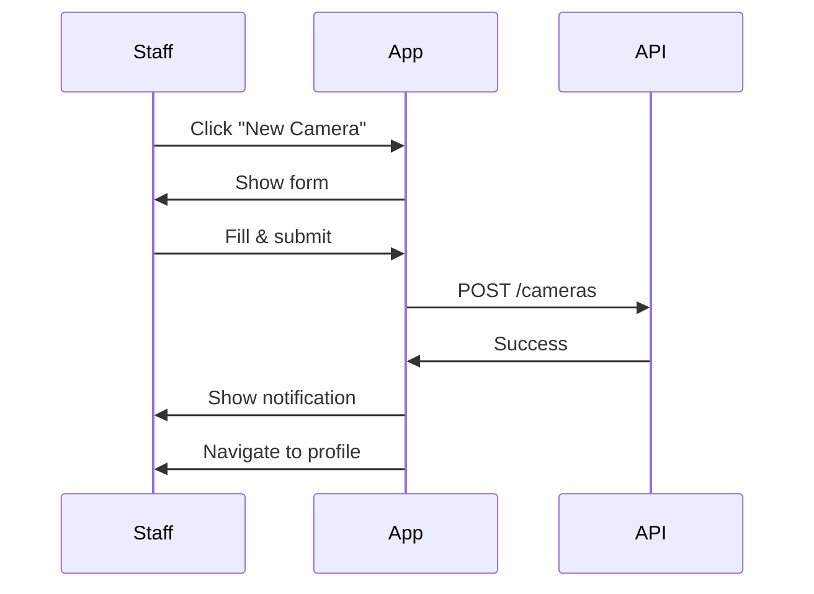

# VSAAS Frontend Review - Modular Prompt Suite

## Overview

This document contains **8 specialized prompts** that can be used independently or as a complete review sequence. Each prompt focuses on a specific aspect of the VSAAS frontend application.

---

## **PROMPT 1: Initial Setup & Architecture Analysis**

### Objective
Establish a comprehensive analysis of the VSAAS frontend codebase, document the technology stack, and analyze the overall architecture.

### Tasks

#### 1. Technology Stack Inventory
Document all technologies used:
- React version and features
- TypeScript configuration
- State management (Zustand)
- Server state (TanStack Query)
- Routing (React Router)
- UI libraries and frameworks
- Build tools
- Development tools

**Deliverable**: Complete technology stack table with versions and purposes

#### 2. Folder Structure Analysis
```
frontend/src/
├── pages/
├── features/
├── components/
├── hooks/
├── stores/
├── api/
├── utils/
├── types/
├── styles/
└── assets/
```

Document:
- Number of files in each directory
- File naming conventions
- Organization pattern (feature-based vs type-based)
- Average file size
- Largest files (>300 lines)

**Deliverable**: File structure documentation with statistics

#### 3. Dependency Analysis
Create a table:
| Package | Version | Size | Purpose | Issues | Replacement Options |
|---------|---------|------|---------|--------|---------------------|

Identify:
- 🟥 Security vulnerabilities
- 🟧 Outdated packages (>2 major versions behind)
- 🟨 Unused dependencies
- 🟩 Optimization opportunities

**Deliverable**: Dependency audit report

#### 4. Application Entry Point
Analyze `App.tsx` or `main.tsx`:
- Operator setup
- Router configuration
- Global state initialization
- Error boundaries
- Theme/design system setup

**Deliverable**: Entry point documentation with diagram

#### 5. Build Configuration
Document:
- Build tool configuration
- Build output structure
- Optimization settings
- Environment variable handling
- Build time and output size

**Deliverable**: Build configuration analysis

### Output Document
**File**: `01-VSAAS-Frontend-Architecture-Overview.md`

**Sections**:
1. Executive Summary
2. Technology Stack
3. Folder Structure & Organization
4. Dependency Analysis
5. Application Bootstrap
6. Build Configuration
7. Initial Recommendations (high-level)

---

## **PROMPT 2: Component Architecture & Design System**

### Objective
Catalog all components, analyze the design system, and evaluate component quality and reusability.

### Required Materials
- Complete `src/components/` directory
- Design system files (colors, typography, spacing)
- Any Tailwind/CSS configuration

### Tasks

#### 1. Complete Component Inventory
Create comprehensive table:
| Component | Location | Type | Lines | Props | Variants | Usage Count | Issues |
|-----------|----------|------|-------|-------|----------|-------------|--------|

Component types:
- Page components
- Feature components
- UI/shared components
- Layout components
- Form components

**Deliverable**: Complete component catalog

#### 2. Design System Documentation

**Colors**:
```css
--primary: #______
--secondary: #______
--success: #______
--error: #______
--warning: #______
--info: #______
```

**Typography**:
- Font families
- Size scale
- Line heights
- Weights

**Spacing**:
- Spacing scale (4px, 8px, 16px, etc.)
- Margin/padding patterns

**Deliverable**: Design system specification

#### 3. Component Deep Dive
For each major component (Button, Input, Modal, Card, etc.):

**Component Name**: Button

**Location**: `src/components/ui/Button.tsx`

**Props Interface**:
```typescript
interface ButtonProps {
  variant: 'primary' | 'secondary' | 'danger' | 'ghost';
  size: 'sm' | 'md' | 'lg';
  disabled?: boolean;
  loading?: boolean;
  onClick?: () => void;
  children: React.ReactNode;
}
```

**Variants**: Document all visual variants
**States**: Default, hover, active, disabled, loading, focus
**Accessibility**: ARIA attributes, keyboard support
**Issues**: List any problems found

**Deliverable**: Individual component documentation for top 15-20 components

#### 4. Design Consistency Audit
Check for:
- 🟥 Components not using design tokens
- 🟧 Inconsistent component APIs
- 🟨 Duplicate components (similar functionality)
- 🟩 Missing essential variants

**Deliverable**: Design consistency report with examples

#### 5. Component Reusability Analysis
Identify:
- Highly reusable components (used 10+ times)
- Under-utilized components (used 1-2 times)
- Components that should be split
- Components that should be combined

**Deliverable**: Reusability recommendations

### Output Document
**File**: `02-VSAAS-Component-Library.md`

**Sections**:
1. Component Inventory
2. Design System
3. Component Documentation (by category)
4. Design Consistency Analysis
5. Reusability Assessment
6. Improvement Recommendations

---

## **PROMPT 3: State Management & Data Flow**

### Objective
Analyze Zustand stores, TanStack Query implementation, and overall state management architecture.

### Required Materials
- All files in `src/stores/`
- All files in `src/api/`
- TanStack Query configuration
- Custom hooks related to data fetching

### Tasks

#### 1. Zustand Store Analysis
For each store:

**Store**: `authStore`
**File**: `src/stores/authStore.ts`

**State Shape**:
```typescript
interface AuthState {
  user: User | null;
  token: string | null;
  isAuthenticated: boolean;
  // ... complete interface
}
```

**Actions**:
- `login(credentials)` - Description
- `logout()` - Description
- `refreshToken()` - Description

**Persistence**: localStorage key, what persists

**Usage**: List components/pages using this store

**Issues**: 
- 🟥 Critical issues
- 🟧 High priority issues
- 🟨 Medium issues

**Deliverable**: Complete documentation for each Zustand store

#### 2. TanStack Query Configuration
Document:
```typescript
{
  defaultOptions: {
    queries: {
      staleTime: ?,
      cacheTime: ?,
      retry: ?,
      refetchOnWindowFocus: ?,
    }
  }
}
```

**Deliverable**: Query client configuration documentation

#### 3. Query Hooks Inventory
| Hook | Purpose | Query Key | Cache Config | Error Handling | Issues |
|------|---------|-----------|--------------|----------------|--------|
| useClients | Fetch camera list | ['cameras', filters] | 5min stale | ✓ | None |

**Deliverable**: Complete query hooks catalog

#### 4. Data Flow Diagrams
Create flow diagrams for:
- User login flow
- Data fetching flow
- Data mutation flow
- Cache invalidation flow

**Deliverable**: Mermaid sequence diagrams

#### 5. State Synchronization Analysis
Evaluate:
- Separation of server state (TanStack Query) vs client state (Zustand)
- State consistency across components
- Redundant state
- State normalization

Identify:
- 🟥 Critical: Data inconsistencies
- 🟧 High: Redundant state
- 🟨 Medium: Poor cache invalidation
- 🟩 Low: Optimization opportunities

**Deliverable**: State synchronization report

### Output Document
**File**: `03-VSAAS-State-Management.md`

**Sections**:
1. State Management Overview
2. Zustand Stores Documentation
3. TanStack Query Configuration
4. Query Hooks Catalog
5. Data Flow Diagrams
6. State Synchronization Analysis
7. Improvement Recommendations

---

## **PROMPT 4: Routing, Navigation & User Flows**

### Objective
Document routing architecture, navigation patterns, and map all user journeys for each role.

### Tasks

#### 1. Route Structure Documentation
Create complete route tree:
```
/
├── /login
├── /forgot-password
├── /dashboard
│   ├── /super-admin
│   │   ├── /users
│   │   ├── /organizations
│   │   └── /settings
│   ├── /admin
│   │   ├── /team
│   │   ├── /cameras
│   │   └── /recordings
│   └── [other role routes]
└── [other routes]
```

Document:
- Total routes: ?
- Protected routes: ?
- Public routes: ?
- Dynamic routes: ? (list parameters)

**Deliverable**: Complete route hierarchy

#### 2. Protected Route Implementation
Analyze:
```typescript
// Show the protection mechanism
<ProtectedRoute allowedRoles={['admin', 'staff']}>
  <ClientList />
</ProtectedRoute>
```

Document:
- How authentication is checked
- How roles are verified
- Redirect logic
- Unauthorized handling

**Deliverable**: Route protection documentation

#### 3. Permission Matrix
| Route/Feature | Super Admin | Admin | Operator | Staff | Camera |
|---------------|-------------|-------|----------|-------|---------|
| Dashboard | ✓ | ✓ | ✓ | ✓ | ✓ |
| User Management | ✓ | ✓ | ✗ | ✗ | ✗ |
| [All features...] | | | | | |

**Deliverable**: Complete permission matrix

#### 4. Navigation Patterns
Document:
- Desktop navigation structure
- Mobile navigation structure
- Breadcrumb implementation
- Role-based menu differences

**Deliverable**: Navigation architecture documentation

#### 5. User Journey Mapping
For each role, create detailed journey:

**Journey**: Camera Registration (Staff)

**Sequence Diagram**:


**Steps**:
1. Starting point
2. User action
3. System response
4. [Continue...]

**Time to complete**: ~3 minutes

**Pain points**:
- 🟧 Form too long
- 🟨 Unclear required fields

**Deliverable**: 5-7 critical user journeys documented

### Output Document
**File**: `04-VSAAS-Navigation-UserFlows.md`

**Sections**:
1. Routing Architecture
2. Protected Routes Implementation
3. Permission Matrix
4. Navigation Patterns
5. User Journey Maps (by role)
6. Conditional Logic Analysis
7. Improvement Recommendations

---

## **PROMPT 5: Forms, Validation & User Input**

### Objective
Evaluate all forms, input components, validation patterns, and data input user experience.

### Tasks

#### 1. Form Inventory
| Form | Location | Fields | Validation Library | Multi-step | Issues |
|------|----------|--------|-------------------|------------|--------|
| Login | LoginPage | 2 | Custom | No | None |
| Camera Registration | ClientForm | 15+ | ? | No | Too long |

**Deliverable**: Complete form catalog

#### 2. Input Component Catalog
| Component | Type | Variants | Validation | Accessibility | Issues |
|-----------|------|----------|------------|---------------|--------|
| TextInput | text | default, error | ✓ | ✓ | None |
| DatePicker | date | ? | ✓ | ⚠ | Keyboard nav |

Document all:
- Text inputs
- Email/Phone inputs
- Date/Time pickers
- Selects/Dropdowns
- Checkboxes/Radio buttons
- File uploads
- Rich text editors

**Deliverable**: Input component documentation

#### 3. Form Deep Dive
For 3-5 critical forms:

**Form**: Camera Registration

**Fields Analysis**:
```typescript
// Personal Info Section
- Nome completo (required, min 3 chars)
- ID (required, valid format)
- Data de nascimento (required, date picker)
- Email (optional, valid email)
- Telefone (required, Brazilian format)

// Address Section (optional)
- CEP (Brazilian postal code, autocomplete)
- Logradouro, Número, Complemento, etc.

// Medical Info (optional)
- Alergias (textarea, optional)
- Condições médicas (textarea, optional)
```

**Validation Rules**:
- Document all validation
- Test validation messages
- Check error display

**UX Analysis**:
- ✅ Good: Clear labels
- ⚠️ Issue: Too many fields on one screen
- ❌ Problem: No autosave

**Mobile Experience**:
- Test on mobile device
- Check keyboard behavior
- Verify touch targets

**Deliverable**: Detailed form analysis for each critical form

#### 4. Validation Pattern Analysis
Document:
- Client-side validation approach
- Validation library (Yup, Zod, custom)
- Real-time vs on-submit validation
- Error message patterns
- Field-level vs form-level errors

Example validation messages (Portuguese):
```
"Este campo é obrigatório"
"Email inválido"
"ID inválido"
```

Check:
- 🟥 English messages (should be Portuguese)
- 🟧 Technical jargon
- 🟨 Unclear messages
- 🟩 Could be more helpful

**Deliverable**: Validation pattern documentation

#### 5. Form UX Improvements
For each form, propose:
- Layout improvements
- Multi-step conversion (if needed)
- Field grouping
- Progressive disclosure
- Autosave functionality
- Better error feedback
- Mobile optimization

**Deliverable**: Form improvement recommendations with mockups

### Output Document
**File**: `05-VSAAS-Forms-Validation.md`

**Sections**:
1. Form Inventory
2. Input Component Library
3. Critical Forms Deep Dive
4. Validation Patterns
5. Form UX Analysis
6. Mobile Form Experience
7. Improvement Recommendations

---

## **PROMPT 6: UI/UX, Accessibility & Responsive Design**

### Objective
Evaluate user interface quality, accessibility compliance, responsive design, and overall user experience.

### Tasks

#### 1. Design Consistency Audit
Test across 10-15 key pages:
| Page | Color Consistency | Typography | Spacing | Layout | Issues |
|------|------------------|------------|---------|--------|--------|
| Login | ✓ | ✓ | ✓ | ✓ | None |
| Dashboard | ⚠ | ✓ | ⚠ | ✓ | Mixed button styles |

**Deliverable**: Visual consistency report

#### 2. Responsive Design Testing

**Breakpoints**:
```css
mobile: 0-768px
tablet: 769-1024px
desktop: 1025px+
```

**Test Matrix**:
| Page | Mobile (375px) | Tablet (768px) | Desktop (1920px) | Issues |
|------|----------------|----------------|------------------|--------|
| Login | ✓ Good | ✓ Good | ✓ Good | None |
| Dashboard | ✗ Broken | ⚠ Issues | ✓ Good | Horizontal scroll on mobile |

Test on:
- iPhone SE (375px)
- iPhone 14 (390px)
- iPad (768px)
- Desktop (1920px)

**Deliverable**: Responsive design audit with screenshots

#### 3. Accessibility Compliance (WCAG 2.1 AA)

**Automated Testing**:
- Run Lighthouse on all key pages
- Run axe DevTools
- Document scores and violations

**Keyboard Navigation Testing**:
- Tab through entire application
- Document tab order issues
- Test all interactive elements
- Check focus indicators
- Test modal focus trapping

**Screen Reader Testing** (NVDA/JAWS/VoiceOver):
- Test navigation
- Test forms
- Test error messages
- Test dynamic content

**Color Contrast Audit**:
| Element | Foreground | Background | Ratio | Pass/Fail |
|---------|------------|------------|-------|-----------|
| Body text | #333333 | #FFFFFF | 12.6:1 | ✓ Pass |
| Button | #FFFFFF | #007BFF | ?.?:1 | ? |

**Deliverable**: Comprehensive accessibility audit report

#### 4. Animation & Interaction Quality
Document all animations:
| Animation | Location | FPS | GPU Accel | Jarring | Purpose Clear |
|-----------|----------|-----|-----------|---------|---------------|
| Page transition | App | 60 | ✓ | No | Yes |
| Modal open | Modal | 55 | ✓ | Slightly | Yes |

Check:
- Smooth 60fps performance
- Respects `prefers-reduced-motion`
- Meaningful animations (not gratuitous)

**Deliverable**: Animation quality report

#### 5. Loading States & Feedback
Document:
- Loading patterns (skeleton, spinner, progress)
- Success feedback (toasts, messages)
- Error feedback (messages, recovery)
- Empty states (messaging, CTAs)

**Deliverable**: Feedback mechanisms documentation

#### 6. Mobile-Specific UX
Test:
- Touch target sizes (min 44x44px)
- Mobile navigation usability
- Form input on mobile keyboards
- Gesture support
- Mobile performance

**Deliverable**: Mobile UX evaluation

### Output Document
**File**: `06-VSAAS-UX-Accessibility.md`

**Sections**:
1. Design Consistency Audit
2. Responsive Design Evaluation
3. Accessibility Compliance Report
4. Keyboard Navigation
5. Screen Reader Support
6. Animation & Interaction Quality
7. Loading States & Feedback
8. Mobile UX Analysis
9. Improvement Priorities

---

## **PROMPT 7: Performance, Code Quality & Security**

### Objective
Analyze application performance, evaluate code quality, assess TypeScript usage, and review security practices.

### Required Materials
- Complete source code
- Build output and bundle analysis
- Access to Chrome DevTools
- Testing framework files (if any)

### Tasks

#### 1. Performance Analysis

**Lighthouse Audits**:
Run on all key pages:
| Page | Performance | Accessibility | Best Practices | SEO |
|------|-------------|---------------|----------------|-----|
| Login | ?/100 | ?/100 | ?/100 | ?/100 |

**Core Web Vitals**:
| Page | LCP | FID | CLS | Pass/Fail |
|------|-----|-----|-----|-----------|
| Login | ?s | ?ms | ? | ? |

**Bundle Analysis**:
```
Total: ??? KB (gzipped)

Largest dependencies:
1. [package]: ??? KB
2. [package]: ??? KB

Largest modules:
1. [file]: ??? KB
2. [file]: ??? KB
```

**React DevTools Profiler**:
- Identify components with excessive re-renders
- Measure render times
- Find performance bottlenecks

**Deliverable**: Complete performance audit report

#### 2. Code Quality Analysis

**TypeScript Usage**:
- Strict mode: Enabled / Disabled
- `any` type count: ?
- Type coverage: Estimate %
- Missing type definitions

**React Patterns Audit**:
✅ Good patterns found:
- Functional components
- Custom hooks
- Proper key props

❌ Anti-patterns found:
| Anti-Pattern | Count | Examples | Priority |
|--------------|-------|----------|----------|
| Large components (>300 LOC) | ? | [List] | 🟧 High |
| Props drilling (>3 levels) | ? | [Examples] | 🟧 High |
| Missing useEffect deps | ? | [Examples] | 🟥 Critical |

**Code Organization**:
- File size distribution
- Code duplication analysis
- Naming convention consistency

**Deliverable**: Code quality report

#### 3. Error Handling Analysis
Document:
- Error boundary implementation
- API error handling patterns
- Global error handling
- User-facing error messages
- Error logging

Identify:
- 🟥 Unhandled errors
- 🟧 Inconsistent error handling
- 🟨 Poor error messages
- 🟩 Missing error logging

**Deliverable**: Error handling assessment

#### 4. Security Review

**Authentication Security**:
- Token storage method
- Token expiration handling
- Password handling
- Session management

**XSS Protection**:
- dangerouslySetInnerHTML usage
- User-generated content handling

**Data Security**:
- Sensitive data in URLs
- Sensitive data in logs
- LGPD compliance considerations

**API Security**:
- API keys exposure
- Request validation
- HTTPS enforcement

Identify:
- 🟥 Critical security issues
- 🟧 Security improvements needed
- 🟨 Best practice violations

**Deliverable**: Security audit report

#### 5. Testing Coverage
Document:
- Testing framework: Jest / None
- Test count: Unit, Integration, E2E
- Coverage percentage: ?%
- Critical paths without tests

**Deliverable**: Testing assessment

### Output Document
**File**: `07-VSAAS-Performance-Quality-Security.md`

**Sections**:
1. Performance Analysis
2. Core Web Vitals
3. Bundle Size Analysis
4. Code Quality Evaluation
5. TypeScript Usage
6. React Patterns Audit
7. Error Handling
8. Security Review
9. Testing Coverage
10. Optimization Recommendations

---

## **PROMPT 8: Improvement Roadmap & Action Plan**

### Objective
Using the entire frontend documentation ('docs/frontend/') prioritize improvements and create actionable roadmap with effort estimates.

### Tasks

#### 1. Issue Compilation
Gather all issues from the documents and categorize:

**🟥 Critical (P0) - Must Fix Immediately**
| # | Issue | Impact | Users Affected | Effort | Dependencies |
|---|-------|--------|----------------|--------|--------------|
| 1 | [Issue] | [Impact] | All users | 2 days | None |

**🟧 High Priority (P1) - Address in Next Sprint**
[Same table structure]

**🟨 Medium Priority (P2) - Plan for Future Sprints**
[Same table structure]

**🟩 Low Priority (P3) - Nice to Have**
[Same table structure]

**Deliverable**: Comprehensive prioritized issue list

#### 2. Quick Wins Identification
Find high-impact, low-effort improvements:

**Quick Win #1**: Fix color contrast on buttons
- **Impact**: WCAG compliance, better UX
- **Effort**: 2 hours
- **Implementation**: Update CSS variables

[List 10-15 quick wins]

**Deliverable**: Quick wins list

#### 3. Technical Debt Assessment
Quantify technical debt:
- Code quality debt: ? days
- Testing debt: ? days
- Documentation debt: ? days
- Architecture debt: ? days
- **Total**: ? weeks of work

**Deliverable**: Technical debt report

#### 4. Implementation Roadmap

**Sprint 1 (Weeks 1-2): Critical Fixes**
- [ ] Fix security vulnerability in token storage (2 days)
- [ ] Fix accessibility violations (3 days)
- [ ] Implement error boundary (1 day)
- [ ] [Continue...]

**Sprint 2 (Weeks 3-4): High Priority**
- [ ] Refactor large components (5 days)
- [ ] Improve form validation (3 days)
- [ ] [Continue...]

**Sprint 3-4 (Weeks 5-8): Medium Priority**
[Continue...]

**Deliverable**: Detailed sprint-by-sprint roadmap

#### 5. Success Metrics

**Current Baseline**:
- Performance score: ?/100
- Accessibility score: ?/100
- Bundle size: ? KB
- Test coverage: ?%

**Target Goals** (3 months):
- Performance score: >90/100
- Accessibility score: >95/100
- Bundle size: <500 KB
- Test coverage: >80%

**Deliverable**: Success metrics dashboard

#### 6. Executive Summary
Create 2-3 page summary:
- Overall health score: ?/100
- Top 3 strengths
- Top 3 critical issues
- Recommended priority actions
- Budget estimate
- Timeline
- Expected outcomes

**Deliverable**: Executive summary document

### Output Documents

**File 1**: `08-VSAAS-Improvement-Roadmap.md`
- Complete prioritized issue list
- Sprint-by-sprint implementation plan
- Effort estimates
- Dependencies
- Success metrics

**File 2**: `09-VSAAS-Quick-Wins.md`
- All quick win opportunities
- Implementation guides
- Expected impact

**File 3**: `10-VSAAS-Technical-Debt.md`
- Technical debt quantification
- Debt repayment plan
- Long-term architecture vision

**File 4**: `00-VSAAS-Executive-Summary.md`
- Executive summary (2-3 pages)
- Key findings
- Recommendations
- Budget and timeline

**File 5**: `00-VSAAS-Master-Index.md`
- Links to all documents
- Navigation guide
- Version history
- Quick reference

---

## Usage Guide

### Sequential Approach (Recommended)
Use prompts in order 1→8 for complete documentation:
- **Week 1**: Prompts 1-2 (Architecture & Components)
- **Week 2**: Prompts 3-4 (State & Navigation)
- **Week 3**: Prompts 5-6 (Forms & UX)
- **Week 4**: Prompts 7-8 (Performance & Roadmap)

### Targeted Approach
Use individual prompts for specific areas of concern:
- Need state management review only? → Use Prompt 3
- Need accessibility audit? → Use Prompt 6
- Need performance analysis? → Use Prompt 7

### Iterative Approach
1. Start with Prompt 1 (architecture overview)
2. Choose 2-3 additional prompts based on priorities
3. Use Prompt 8 to create roadmap for chosen areas

---

## Document Naming Convention

```
00-VSAAS-Master-Index.md
00-VSAAS-Executive-Summary.md
01-VSAAS-Architecture-Overview.md
02-VSAAS-Component-Library.md
03-VSAAS-State-Management.md
04-VSAAS-Navigation-UserFlows.md
05-VSAAS-Forms-Validation.md
06-VSAAS-UX-Accessibility.md
07-VSAAS-Performance-Quality-Security.md
08-VSAAS-Improvement-Roadmap.md
09-VSAAS-Quick-Wins.md
10-VSAAS-Technical-Debt.md
```

---

## Tips for Best Results

1. **Provide complete code access** for each prompt
2. **Include context** about business priorities
3. **Test with real user credentials** for different roles
4. **Take screenshots** as you go
5. **Document as you discover** (don't wait until the end)
6. **Cross-reference** findings between prompts
7. **Be specific** in improvement recommendations
8. **Include code examples** for proposed fixes
9. **Estimate effort realistically**
10. **Focus on actionable insights**

---

## Deliverable Checklist

After completing all prompts, ensure you have:

- [ ] 10+ markdown documents
- [ ] Architecture diagrams (Mermaid)
- [ ] User flow diagrams (Mermaid)
- [ ] Component library documentation
- [ ] Permission matrix
- [ ] Form analysis for all critical forms
- [ ] Accessibility audit report
- [ ] Performance metrics (Lighthouse scores)
- [ ] Prioritized improvement list
- [ ] Implementation roadmap
- [ ] Executive summary
- [ ] Master index document
- [ ] Screenshots of key pages
- [ ] Before/after mockups for improvements

---

**Ready to begin? Start with Prompt 1 and provide the required materials!**